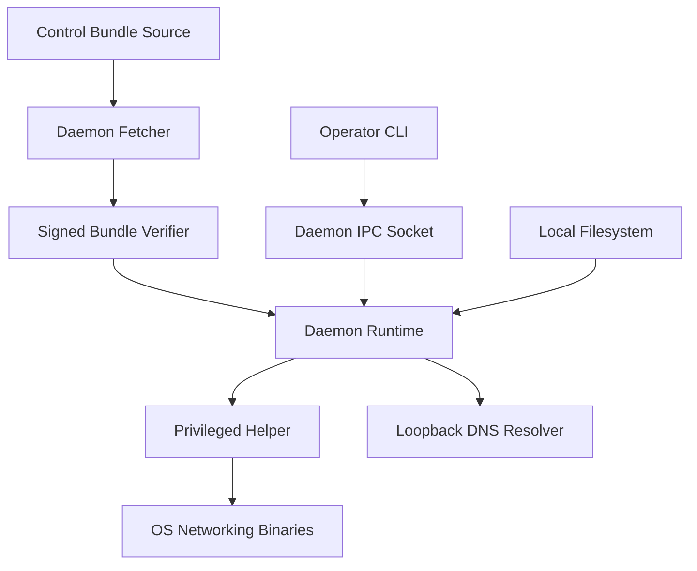

# Rustynet Security Review and Threat Model

Date: 2026-03-24
Archive status: historical point-in-time security review; not a normative implementation plan.

## Implementation Agent Prompt

Execution document: [SecurityReview-2026-03-24.md](./SecurityReview-2026-03-24.md)

```text
You are the implementation agent for this repository. Your job is to remediate the security findings in this document to the best of your ability in a single uninterrupted execution if possible. Security is the top priority. Do not optimize for speed over correctness. Do not preserve weaker legacy paths or add runtime fallbacks. Prefer one hardened path for each security-sensitive workflow.

Repository root:
/Users/iwanteague/Desktop/Rustynet

Primary report to use as source of truth:
/Users/iwanteague/Desktop/Rustynet/documents/archive/SecurityReview-2026-03-24.md

Use the linked execution document above and the path above as the same source-of-truth file. If they ever appear to disagree, treat that as a documentation error and reconcile the file before claiming completion.

Before writing code:
1. Read these documents in this order:
   - /Users/iwanteague/Desktop/Rustynet/AGENTS.md
   - /Users/iwanteague/Desktop/Rustynet/CLAUDE.md
   - /Users/iwanteague/Desktop/Rustynet/README.md
   - /Users/iwanteague/Desktop/Rustynet/documents/Requirements.md
   - /Users/iwanteague/Desktop/Rustynet/documents/SecurityMinimumBar.md
   - this security review document
2. Treat the finding sections plus the Detailed Remediation Appendix as the execution plan.
3. Separate active runtime/security issues from latent/dev-only issues. Fix the highest-risk active issues first.

Execution priorities:
1. Fix active fail-open, authz, identity-binding, parser-safety, and trust-boundary issues first.
2. Then fix release-assurance and gate drift that can let regressions ship.
3. Then fix operator/e2e/reporting/tooling issues that still create real privileged or evidence-integrity risk.
4. Then remove or lock down dormant weak paths that could be reintroduced later.

Priority-tag mapping for this document:
- `P0` = Batch 0 and Batch 1. These are the immediate verify-or-fix items required before claiming a secure baseline or lab-readiness.
- `P1` = Batch 2. These are the next active hardening items directly coupled to runtime, signed-artifact, or parser correctness.
- `P2` = Batch 3. These are privileged tooling, bootstrap, operator, e2e, and evidence-integrity issues with real security impact.
- `P3` = Batch 4. These are latent, privacy, or lower-priority cleanup items after `P0` through `P2`.

Work ordering guidance:
- Start with findings like supply-chain fail-open, stale security gates, enrollment identity binding, relay identity binding, parser panic paths, membership fail-open paths, node overwrite on enrollment collision, and unbounded abuse state.
- After those, move into delimiter-safe serializers, structured logging/audit, path custody, shell removal, temp-file custody, and report/evidence validators.
- Only take on lower-severity or latent items after the higher-priority active issues are either fixed or clearly blocked.
- For one strong implementation run, Batch 1 plus any directly coupled Batch 2 items are the mandatory core scope before spending meaningful time on Batch 3 or Batch 4.

Explicit finding batches for this repository:
- Batch 0: verify already-remediated findings before spending code effort on them. These are regression-check items first, not default rewrite targets:
  - `SR-001`, `SR-002`, `SR-003`, `SR-008`
- Batch 1: highest-priority active runtime / authz / fail-closed / parser issues. Start here:
  - `SR-004`, `SR-005`, `SR-009`, `SR-010`, `SR-012`, `SR-014`, `SR-047`, `SR-048`, `SR-049`, `SR-050`
- Batch 2: active runtime hardening and signed-artifact correctness immediately adjacent to Batch 1:
  - `SR-011`, `SR-013`, `SR-024`, `SR-025`, `SR-026`, `SR-027`
- Batch 3: privileged operator surfaces, custody, bootstrap, evidence integrity, and active-network validator issues:
  - `SR-006`, `SR-007`, `SR-015`, `SR-016`, `SR-017`, `SR-018`, `SR-019`, `SR-020`, `SR-021`, `SR-028`, `SR-029`, `SR-030`, `SR-031`, `SR-032`, `SR-033`, `SR-034`, `SR-035`, `SR-036`, `SR-037`, `SR-038`, `SR-039`, `SR-040`, `SR-041`, `SR-042`, `SR-043`, `SR-044`, `SR-045`, `SR-046`
- Batch 4: lower-severity latent/privacy cleanup after the above:
  - `SR-022`, `SR-023`

Preferred first-pass file targets:
- `SR-004`, `SR-005`:
  - `/Users/iwanteague/Desktop/Rustynet/crates/rustynet-cli/src/ops_ci_release_perf.rs`
- `SR-009`, `SR-049`, `SR-050`:
  - `/Users/iwanteague/Desktop/Rustynet/crates/rustynet-control/src/lib.rs`
  - `/Users/iwanteague/Desktop/Rustynet/crates/rustynet-control/src/persistence.rs`
  - `/Users/iwanteague/Desktop/Rustynet/crates/rustynet-backend-api/src/lib.rs`
- `SR-010`, `SR-012`:
  - `/Users/iwanteague/Desktop/Rustynet/crates/rustynet-relay/src/transport.rs`
  - `/Users/iwanteague/Desktop/Rustynet/crates/rustynet-relay/src/rate_limit.rs`
- `SR-014`:
  - `/Users/iwanteague/Desktop/Rustynet/crates/rustynetd/src/ipc.rs`
  - related daemon tests in `/Users/iwanteague/Desktop/Rustynet/crates/rustynetd/src/daemon.rs`
- `SR-047`:
  - `/Users/iwanteague/Desktop/Rustynet/crates/rustynetd/src/phase10.rs`
  - possibly `/Users/iwanteague/Desktop/Rustynet/crates/rustynet-policy/src/lib.rs` if policy semantics also need tightening
- `SR-048`:
  - `/Users/iwanteague/Desktop/Rustynet/crates/rustynetd/src/dataplane.rs`
- `SR-011`, `SR-013`, `SR-024`, `SR-025`, `SR-026`, `SR-027`:
  - `/Users/iwanteague/Desktop/Rustynet/crates/rustynet-control/src/operations.rs`
  - `/Users/iwanteague/Desktop/Rustynet/crates/rustynet-control/src/membership.rs`
  - `/Users/iwanteague/Desktop/Rustynet/crates/rustynet-control/src/lib.rs`
  - `/Users/iwanteague/Desktop/Rustynet/crates/rustynet-cli/src/ops_install_systemd.rs`
  - `/Users/iwanteague/Desktop/Rustynet/crates/rustynet-cli/src/main.rs`

Non-negotiable constraints:
- Security is the top priority.
- One hardened path only. No runtime fallbacks, compatibility shortcuts, shell fallbacks, or legacy parallel flows in production-sensitive code.
- Fail closed when trust, identity, signed state, membership, parser validity, or secure custody checks fail.
- Do not weaken verification, parser strictness, or custody checks to make tests pass.
- Prefer deleting dead weak code over preserving it.

Required execution behavior:
- Implement code, run tests, inspect failures, fix root causes, and continue.
- Do not stop after analysis if you can still make progress.
- If you hit a blocker, work around it if possible. If not possible, document it clearly in this file.
- Keep the document synchronized as you go so another agent can resume without ambiguity.

Document tracking rules:
For every finding you materially work on, update its section in this document only after real progress is made.
Under the finding, append these lines:
- Remediation status: `completed`, `partial`, or `blocked`
- Implemented changes: short bullet list of actual code/config/doc changes
- Verification: exact tests, gates, dry runs, or live runs performed
- Residual risk: what still remains, if anything

Place those four lines directly below the existing `Recommended fix:` block for that finding unless the finding already has remediation-tracking lines, in which case update the existing tracking block in place instead of creating duplicates.
Do not delete the original finding text, severity heading, evidence, or recommended-fix text unless you are correcting a factual inaccuracy discovered during implementation.
Do not renumber findings. Keep `SR-001` through `SR-050` stable so later agents can diff progress reliably.

If one patch fixes multiple findings:
- update every affected finding, not just the one you started from
- keep the wording concise, but do not leave related findings stale
- if one finding is only partially addressed by a shared patch, say so explicitly

Status definitions:
- `completed` means the code or gate change is landed, the intended security property is actually enforced in the relevant path, the relevant tests/gates for that finding class ran and passed, and there is no remaining in-scope follow-up needed to call that finding fixed in this repository.
- `partial` means some meaningful hardening landed, but a real part of the finding is still open. `partial` must say exactly what is fixed, what is still open, and the next concrete file or gate to touch.
- `blocked` means the finding cannot be finished in this execution because of a real external dependency such as missing credentials, missing environment connectivity, a repo-external system, or a design decision that cannot be resolved safely inside this repository alone. `blocked` must say exactly what external prerequisite is missing.

Only mark a finding `completed` if:
- the code path is actually hardened,
- the relevant tests or gates pass,
- and no known in-scope follow-up is required for that finding to be considered fixed in this repository.

Documentation-only edits do not count as completing a code finding unless the finding itself is specifically about documentation, assurance wording, or a stale gate/report description. Do not mark a runtime or parser bug `completed` just because you updated this file.

Special rule for findings that may already be remediated in the current working tree:
- First verify whether the existing code already satisfies the finding and whether the regression tests still pass.
- If yes, do not spend the first implementation pass rewriting that area. Instead update the finding with:
  - `Remediation status: completed`
  - `Implemented changes: pre-existing hardening verified; no new code changes required in this execution`
  - verification evidence showing the regression check you ran
- Only reopen a previously remediated finding if you discover a real regression, incomplete hardening, or a mismatch between the finding text and the current code.

If a finding cannot be fully completed in this execution:
- mark it `partial` or `blocked`,
- explain exactly why,
- and describe the next required implementation step.

Implementation standards:
- Use Rust-first changes wherever feasible.
- Keep security-sensitive validation centralized and typed where possible.
- Make invalid states unrepresentable using constructors, enums, wrappers, or dedicated validators.
- For artifact and config parsing, enforce strict schema, size, count, depth, and character constraints before use.
- For filesystem custody, reject symlinks, require approved roots, use create-new temp files, sync data, and atomically rename.
- For privilege boundaries, use argv-only execution with strict allowlists and binary custody validation.
- For state caches and abuse defenses, apply explicit bounds, pruning, and pressure-safe behavior.
- For signed artifacts, bind signatures to exact canonical payloads and reject extra or ambiguous input.

Testing and verification requirements:
Run verification continuously, not only at the end.

Minimum recurring gates for substantial work:
- cargo fmt --all -- --check
- cargo clippy --workspace --all-targets --all-features -- -D warnings
- cargo check --workspace --all-targets --all-features
- cargo test --workspace --all-targets --all-features
- cargo audit --deny warnings
- cargo deny check bans licenses sources advisories

Also run any relevant security scripts when touched by your changes:
- ./scripts/ci/phase9_gates.sh
- ./scripts/ci/phase10_gates.sh
- ./scripts/ci/membership_gates.sh
- ./scripts/ci/secrets_hygiene_gates.sh
- ./scripts/ci/supply_chain_integrity_gates.sh

Finding-to-verification mapping:
- If you touch `rustynet-control/src/lib.rs`, `membership.rs`, or persistence-related identity/signing logic:
  - run targeted `cargo test -p rustynet-control --all-targets`
  - run `./scripts/ci/membership_gates.sh`
- If you touch `rustynetd/src/ipc.rs`, `daemon.rs`, `dataplane.rs`, or `phase10.rs`:
  - run targeted `cargo test -p rustynetd --all-targets`
  - run `./scripts/ci/phase10_gates.sh` when phase10 or daemon runtime behavior is affected
- If you touch relay logic:
  - run targeted `cargo test -p rustynet-relay --all-targets`
- If you touch release, supply-chain, or regression-gate code:
  - run `./scripts/ci/supply_chain_integrity_gates.sh`
  - run `cargo run --quiet -p rustynet-cli -- ops run-security-regression-gates`
- If you touch secrets or key-custody paths:
  - run `./scripts/ci/secrets_hygiene_gates.sh`
- During iteration, targeted package tests are acceptable.
- Before declaring a finding `completed`, run the package tests and scripts that actually cover that finding class.

Additional required verification style:
- Add or update negative tests for every hardened parser, privilege boundary, identity check, or artifact validator you change.
- Add fuzz or adversarial tests where the finding specifically concerns parser robustness, replay, or oversized/malformed input.
- Run smoke tests and dry runs for install/orchestration flows you modify.
- If a test or gate fails, fix the root cause and rerun the impacted checks.

Execution discipline:
- Do not broaden scope randomly. Work in finding order unless a dependency forces a different order, and if that happens, note the dependency in the affected findings.
- When a finding spans several files, harden the shared validator or constructor first so the security property is centralized rather than duplicated.
- When a finding says to remove a weak path, prefer deletion over adding a runtime toggle. Only keep compatibility code if a higher-precedence document explicitly requires it.
- When uncertain whether a finding is active or latent, prove reachability from the current code before spending time on cleanup; record that reachability judgment in the finding update.
- Before marking the repository ready for lab testing, check that the document itself reflects the final state of every touched finding. Unupdated findings count as unfinished work.

Lab-network objective:
Once code and local gates are in good shape, attempt to run live or semi-live validation if connectivity and credentials are available.

Preferred target:
- the 4 headless Debian lab / existing live network scripts already used in this repo

Live-run rule:
- Attempt deployment or orchestration only if the necessary connectivity and auth material are present.
- If live connectivity is unavailable, do not fake success. Record the exact blocker in this document.
- Do not spend early implementation time on live-lab execution before Batch 1 and the relevant Batch 2 work are locally green or clearly blocked.
- If live-lab execution fails, distinguish code defects from environment/connectivity defects and document the difference precisely.
- Prefer repo-contained live validation entrypoints first:
  - `./scripts/e2e/live_linux_lab_orchestrator.sh`
  - `./scripts/e2e/live_linux_two_hop_test.sh`
  - other repo-contained live/e2e scripts only when they directly exercise the code paths you changed

End-state target for this execution:
At minimum, leave the repository in a state that is honestly “ready to test on a lab network.”

Minimum acceptable finish line for one execution:
- every Batch 1 finding is either `completed` or `blocked`
- any Batch 2 finding directly coupled to touched Batch 1 code is also `completed` or `blocked`
- no touched runtime/authz/parser path is left in a knowingly weaker state than when the run started
- local gates for touched areas are green, or code-vs-environment blockers are documented precisely

Use this meaning of “ready to test on a lab network”:
- code compiles,
- relevant unit/integration/security tests pass,
- affected gates are green or any remaining failures are isolated and documented,
- security-sensitive flows touched in this execution are dry-run tested,
- this document is updated with remediation status and verification evidence,
- and the remaining gap to live lab validation is only environment/connectivity or explicitly documented follow-up.

Completion behavior:
- Continue until you have either fixed as many findings as possible in this run or reached a real blocker.
- Do not defer easy follow-on fixes once you are already in the code path.
- Do not claim “ready for lab network” if:
  - touched packages still fail `fmt`, `clippy`, `check`, or `test`,
  - the relevant security gate for a touched finding class is still failing for a code reason,
  - or the document has not been updated with finding-by-finding status and verification.
- At the end, summarize:
  - which findings are completed,
  - which are partial,
  - which are blocked,
  - what gates/tests were run,
  - whether live lab deployment was attempted,
  - and whether the repo is ready to test on a lab network.

Priority-tag discipline:
- Treat the `P0` -> `P3` tags in this document as the default remediation queue.
- Do not change a finding's priority tag casually. Only move a finding if new code evidence changes its reachability, impact, or dependency position, and if you move it, explain why in that finding's update block.
```

## Executive Summary

Rustynet already contains meaningful fail-closed controls around signed state verification, anti-replay watermarks, loopback-only DNS binding, and daemon/helper socket validation. Repo verification showed that some earlier risks were real in code but not wired into the normal install path, and those are now hardened in the current working tree: daemon remote bundle fetch URLs are rejected in hardened daemon paths, bundle staging uses secure create-new local artifacts, privileged helper binary custody is enforced, and remote-ops authorization now rejects same-window replay. Extended read-only passes found additional weaknesses in control-plane enrollment and artifact serialization, relay identity binding and state growth, parser panic handling, phase10 firewall staging, and operator-heavy e2e/reporting paths. The highest-risk remaining gaps are now split between active code and assurance/tooling: supply-chain enforcement is still fail-open in code, enrollment credentials do not appear to constrain enrolled identity, relay session identity is not fully bound to the signed token, the security regression gate has drifted from the actual parser tests, operator-facing privileged orchestration still uses shell-heavy remote execution, and Linux secure-store execution still trusts `PATH`.

## Remediation Priority Tags

- `P0`: immediate verify-or-fix work. These findings block a credible secure baseline, safe lab readiness, or trustworthy security-assurance claims.
- `P1`: next active hardening wave. These findings are directly adjacent to `P0` runtime, parser, and signed-artifact correctness issues and should be completed before broad tooling cleanup.
- `P2`: privileged operator, bootstrap, e2e, reporting, and evidence-integrity issues with real security impact but lower urgency than `P0` and `P1`.
- `P3`: latent, privacy, or lower-priority cleanup items. These still matter, but they should not displace higher-risk active-path work.

Batch alignment:
- `P0` = Batch 0 + Batch 1
- `P1` = Batch 2
- `P2` = Batch 3
- `P3` = Batch 4

## Remediation Priority Index

- `P0`: `SR-001`, `SR-002`, `SR-003`, `SR-004`, `SR-005`, `SR-008`, `SR-009`, `SR-010`, `SR-012`, `SR-014`, `SR-047`, `SR-048`, `SR-049`, `SR-050`
- `P1`: `SR-011`, `SR-013`, `SR-024`, `SR-025`, `SR-026`, `SR-027`
- `P2`: `SR-006`, `SR-007`, `SR-015`, `SR-016`, `SR-017`, `SR-018`, `SR-019`, `SR-020`, `SR-021`, `SR-028`, `SR-029`, `SR-030`, `SR-031`, `SR-032`, `SR-033`, `SR-034`, `SR-035`, `SR-036`, `SR-037`, `SR-038`, `SR-039`, `SR-040`, `SR-041`, `SR-042`, `SR-043`, `SR-044`, `SR-045`, `SR-046`
- `P3`: `SR-022`, `SR-023`

## Scope And Assumptions

In scope:
- [`/Users/iwanteague/Desktop/Rustynet/crates/rustynetd/src`](/Users/iwanteague/Desktop/Rustynet/crates/rustynetd/src)
- [`/Users/iwanteague/Desktop/Rustynet/crates/rustynet-control/src`](/Users/iwanteague/Desktop/Rustynet/crates/rustynet-control/src)
- [`/Users/iwanteague/Desktop/Rustynet/crates/rustynet-crypto/src`](/Users/iwanteague/Desktop/Rustynet/crates/rustynet-crypto/src)
- [`/Users/iwanteague/Desktop/Rustynet/crates/rustynet-cli/src`](/Users/iwanteague/Desktop/Rustynet/crates/rustynet-cli/src)
- [`/Users/iwanteague/Desktop/Rustynet/scripts/ci`](/Users/iwanteague/Desktop/Rustynet/scripts/ci)

Out of scope for this pass:
- UI and website work from the earlier revoked prompts.
- General frontend/browser security review.
- External services not present in this repository.

Assumptions used for ranking:
- `rustynetd` runs with elevated privileges or controls privileged networking state.
- macOS deployments may rely on `wireguard-go` from Homebrew-style locations unless explicitly constrained.
- The main production risk is compromise of node integrity, key custody, or enforced fail-closed availability.

Verified repo facts:
- Remote bundle fetch URLs are present in daemon code and tests, but they are not wired into the normal service/install flow in this repository. The hardened daemon path now rejects them in config validation and discards them when constructing the runtime fetcher.
- macOS deployments do allow `wireguard-go` in Homebrew-style locations, but only when installed through the approved admin workflow and validated as absolute, executable, root-owned binaries in startup and service-management paths.
- There is no production control-plane service in this repository wiring `rustynet-control` auth and rate-limit guards; [`rustynet-control/src/main.rs`](/Users/iwanteague/Desktop/Rustynet/crates/rustynet-control/src/main.rs) is only a scaffold. If such a service exists, it is outside this repository and unverified here.

## System Model

### Primary Components

- `rustynetd` daemon: runtime control, signed artifact ingestion, DNS responder, traversal handling, privileged helper client, dataplane orchestration.
- `rustynet-control`: control-plane library for signed tokens, enrollment, policy, membership, and abuse/rate-limit primitives.
- `privileged_helper`: root-executed Unix-socket helper that invokes approved OS networking binaries.
- `rustynet-cli`: operator tooling, installers, gate runners, release tooling, and live-lab orchestration.
- `rustynet-crypto`: key custody, OS secure-store integration, encryption-at-rest helpers.

### Data Flows And Trust Boundaries

- Control/bundle origin -> daemon remote state fetcher  
  Data: signed trust, traversal, assignment, and DNS zone bundles.  
  Channel: raw HTTP over `TcpStream`.  
  Security guarantees: signature verification, freshness, watermark replay checks after download.  
  Current status: lower-level fetch helper remains in tree, but the hardened daemon path rejects remote fetch URLs and uses pinned local artifacts instead.

- Signed bundle files -> daemon verification/load path  
  Data: signed artifacts plus watermark state.  
  Channel: local filesystem.  
  Security guarantees: signature verification, freshness checks, replay/rollback protection, fail-closed bootstrap behavior.

- Local operator/CLI -> daemon command socket  
  Data: IPC commands, remote-ops envelopes.  
  Channel: Unix domain socket.  
  Security guarantees: path validation, socket permission checks, peer credential checks, command parser hardening.

- Daemon -> privileged helper  
  Data: validated argv-only helper requests.  
  Channel: Unix domain socket with peer-credential validation.  
  Security guarantees: helper request size limits, allowed-program allowlist, per-program argument validation, and binary-custody validation before execution.

- Privileged helper -> OS binaries  
  Data: approved network/system commands and arguments.  
  Channel: local process execution.  
  Security guarantees: argv-only execution, limited binary set, per-command schema checks, canonical-path validation, and root-owned/non-writable binary enforcement.

- Daemon -> local DNS clients  
  Data: managed DNS responses.  
  Channel: UDP on configured resolver socket.  
  Security guarantees: bind address must be loopback, invalid signed DNS state returns `SERVFAIL`.

#### Diagram



## Assets And Security Objectives

| Asset | Why it matters | Security objective |
| --- | --- | --- |
| Node private keys and passphrases | Key theft compromises tunnel identity and peer trust | C/I |
| Signed trust, traversal, assignment, and DNS artifacts | Drive routing, DNS, and trust decisions | I/A |
| Watermark state | Prevents replay and rollback | I |
| Daemon and helper sockets | Control privileged networking behavior | I/A |
| Release artifacts, provenance, and SBOM | Determine whether safe builds reach production | I |
| Audit and security gate results | Enforce the security bar claimed by docs | I/A |

## Attacker Model

### Capabilities

- Remote network attacker on the path between a node and a configured remote bundle endpoint.
- Local unprivileged or low-privileged user on a node who can influence world-writable locations such as the process temp directory.
- Local operator or compromised environment able to influence `PATH` or install user-owned binaries in allowed search locations.
- Malicious or compromised dependency introduced during build/release if supply-chain gates are bypassed.

### Non-Capabilities

- Breaking Ed25519 signatures or watermark logic directly.
- Bypassing loopback-only DNS bind validation without changing configuration or code.
- Arbitrary root access at the start of the attack chain.

## Entry Points And Attack Surfaces

| Surface | How reached | Trust boundary | Notes | Evidence |
| --- | --- | --- | --- | --- |
| Remote signed bundle fetch URLs | `trust_url`, `traversal_url`, `assignment_url`, `dns_zone_url` | Network -> daemon | Present as latent code paths; hardened daemon config now rejects them | [`daemon.rs`](/Users/iwanteague/Desktop/Rustynet/crates/rustynetd/src/daemon.rs) |
| Remote HTTP client | `http_get_raw()` | Network -> daemon | Lower-level fetch helper still only accepts `http://`; hardened daemon path no longer wires it | [`daemon.rs`](/Users/iwanteague/Desktop/Rustynet/crates/rustynetd/src/daemon.rs) |
| Remote bundle temp staging | staged signed bundle writes | Local filesystem -> privileged daemon | Now uses secure create-new local staging next to destination path | [`daemon.rs`](/Users/iwanteague/Desktop/Rustynet/crates/rustynetd/src/daemon.rs) |
| Privileged helper socket | daemon/helper IPC | Local process -> root helper | Peer credential checks and request schema validation present | [`privileged_helper.rs:147`](/Users/iwanteague/Desktop/Rustynet/crates/rustynetd/src/privileged_helper.rs:147), [`privileged_helper.rs:224`](/Users/iwanteague/Desktop/Rustynet/crates/rustynetd/src/privileged_helper.rs:224), [`privileged_helper.rs:528`](/Users/iwanteague/Desktop/Rustynet/crates/rustynetd/src/privileged_helper.rs:528) |
| Root helper binary resolution | helper subprocess execution | Root helper -> OS binaries | Now validates binary custody before execution and fails on the first insecure installed candidate | [`privileged_helper.rs`](/Users/iwanteague/Desktop/Rustynet/crates/rustynetd/src/privileged_helper.rs) |
| Linux secure-store helper execution | `secret-tool` spawn | Process -> external binary | `PATH`-resolved secure-store binary | [`lib.rs:486`](/Users/iwanteague/Desktop/Rustynet/crates/rustynet-crypto/src/lib.rs:486), [`lib.rs:512`](/Users/iwanteague/Desktop/Rustynet/crates/rustynet-crypto/src/lib.rs:512) |
| Security regression gate | CI gate runner | CI -> assurance layer | Required test names are stale | [`ops_ci_release_perf.rs:765`](/Users/iwanteague/Desktop/Rustynet/crates/rustynet-cli/src/ops_ci_release_perf.rs:765), [`daemon.rs:9136`](/Users/iwanteague/Desktop/Rustynet/crates/rustynetd/src/daemon.rs:9136) |
| Supply-chain gate | CI/release tooling | CI -> release assurance | `audit` and `deny` bypassed in code | [`ops_ci_release_perf.rs:1406`](/Users/iwanteague/Desktop/Rustynet/crates/rustynet-cli/src/ops_ci_release_perf.rs:1406), [`ops_ci_release_perf.rs:1648`](/Users/iwanteague/Desktop/Rustynet/crates/rustynet-cli/src/ops_ci_release_perf.rs:1648) |

## Top Abuse Paths

1. Vulnerable dependency enters the tree -> release path skips `cargo audit` and `cargo deny` -> signed artifact and SBOM are produced for a build that missed required policy checks.
2. IPC parser hardening regresses -> stale required-test filters no longer enforce intended negative tests -> regression slips past CI despite security docs claiming coverage.
3. Operator automation composes root shell bodies over SSH -> future variable expansion or quoting mistake becomes root-level command injection in lab or deployment tooling.
4. Local environment attacker shadows `secret-tool` through `PATH` influence -> secure-store operation executes the wrong binary -> key-handling boundary is subverted.

## Findings

### Critical

#### SR-001: Remote signed state fetcher previously used plaintext HTTP in daemon runtime paths

Priority tag: `P0`

Status: remediated in the current working tree for hardened daemon execution paths; lower-level fetch helper code still exists and should be removed if no longer needed.

Impact before remediation: a network attacker could force bootstrap/refresh denial-of-service and observe control-plane artifact traffic because transport security was missing before signature verification ran.

Evidence:
- [`documents/SecurityMinimumBar.md:18`](/Users/iwanteague/Desktop/Rustynet/documents/SecurityMinimumBar.md:18) requires TLS 1.3 for control-plane transport.
- The lower-level fetch helper still implements raw `TcpStream` HTTP and only accepts `http://`.
- The hardened daemon path now rejects `trust_url`, `traversal_url`, `assignment_url`, and `dns_zone_url` in config validation and drops them in `StateFetcher::new_from_daemon`.

Existing controls:
- Signature verification, freshness checks, and watermark replay rejection after download.
- Hardened daemon config now refuses remote fetch URLs entirely.

Recommended fix:
1. Remove the lower-level HTTP fetch helper entirely if no non-daemon consumer needs it.
2. Keep the daemon-side config rejection and constructor discard tests permanent.
3. If remote fetching is ever reintroduced, require TLS 1.3 with pinned identity or mTLS and gate on `https://` only.

#### SR-002: Remote bundle staging previously used predictable temp filenames in the process temp directory

Priority tag: `P0`

Status: remediated in the current working tree.

Impact before remediation: a local attacker could target fixed temp paths and potentially coerce a privileged daemon into clobbering arbitrary files via symlink or replacement attacks.

Evidence:
- Remote bundle staging now uses randomized hidden files adjacent to the destination path with `OpenOptions::create_new(true)` and `0o600`.
- Failed verification paths remove the staged artifact instead of reusing shared temp names.

Existing controls:
- Verification still occurs before promotion to final paths.
- Staging now uses create-new secure local custody files.

Recommended fix:
1. Add explicit negative tests for symlink/pre-existing staging collisions on each fetch path if the lower-level fetcher stays in tree.
2. Remove the dead remote fetch path entirely if it is no longer part of product scope.

#### SR-003: Privileged helper previously resolved root-executed binaries by existence, not custody

Priority tag: `P0`

Status: remediated in the current working tree.

Impact before remediation: if a helper-selected binary path was user-controlled or weakly protected, the helper could execute attacker-controlled code as root.

Evidence:
- The helper candidate list still includes Homebrew-style `wireguard-go` locations for macOS compatibility.
- The helper now validates canonical path, regular-file type, executability, no group/other write bits, and root ownership before execution, and it fails on the first insecure installed candidate.
- By contrast, the dataplane key-management path validates absolute, root-owned, non-writable binaries at [`key_material.rs:781`](/Users/iwanteague/Desktop/Rustynet/crates/rustynetd/src/key_material.rs:781).
- The CLI installer also validates root-owned executables at [`main.rs:5718`](/Users/iwanteague/Desktop/Rustynet/crates/rustynet-cli/src/main.rs:5718).

Existing controls:
- Allowlisted programs only.
- Per-program argv validation.
- Privileged helper socket credential checks.

Recommended fix:
1. Keep the new custody validation and regression tests permanent.
2. Consider pruning user-space candidate directories entirely if the approved macOS workflow can pin a single service-managed binary path.
3. Apply the same binary-custody validation to other external helpers such as `secret-tool`.

### High

#### SR-004: Supply-chain gate is fail-open for `cargo audit` and `cargo deny`

Priority tag: `P0`

Impact: a release can be signed and attested even when required dependency-vulnerability and policy checks never ran.

Evidence:
- [`SecurityMinimumBar.md:63`](/Users/iwanteague/Desktop/Rustynet/documents/SecurityMinimumBar.md:63) makes supply-chain integrity release-blocking.
- [`CLAUDE.md:61`](/Users/iwanteague/Desktop/Rustynet/CLAUDE.md:61) requires `cargo audit` and `cargo deny`.
- [`ops_ci_release_perf.rs:1406`](/Users/iwanteague/Desktop/Rustynet/crates/rustynet-cli/src/ops_ci_release_perf.rs:1406) returns success before running them.
- [`ops_ci_release_perf.rs:1648`](/Users/iwanteague/Desktop/Rustynet/crates/rustynet-cli/src/ops_ci_release_perf.rs:1648) treats those tools as optional.

Existing controls:
- Provenance generation and verification.
- SBOM generation and tamper checks.

Gap:
- Dependency and source policy enforcement can be skipped by default.

Recommended fix:
1. Remove the unconditional early return.
2. Make `cargo audit` and `cargo deny` mandatory in CI and release code paths.
3. If local bypass exists, require an explicit non-release override and reject it for beta/stable tracks.

#### SR-005: Security regression gate does not enforce the intended parser-hardening tests

Priority tag: `P0`

Impact: parser or IPC hardening can regress without the intended negative-test coverage actually being checked by CI.

Evidence:
- [`ops_ci_release_perf.rs:765`](/Users/iwanteague/Desktop/Rustynet/crates/rustynet-cli/src/ops_ci_release_perf.rs:765) requires `daemon::tests::read_command_rejects_oversized_payload` and `daemon::tests::read_command_rejects_null_byte_payload`.
- [`daemon.rs:9136`](/Users/iwanteague/Desktop/Rustynet/crates/rustynetd/src/daemon.rs:9136) currently exposes `read_command_envelope_rejects_null_byte_payload`.
- There is no matching oversized `read_command` test name in the current tree.

Existing controls:
- The gate does fail closed when the filter matches zero tests.

Gap:
- The policy intent and the enforced test set have drifted apart.

Recommended fix:
1. Update the required-test list to current test names.
2. Add an explicit oversized command-envelope negative test if it is absent.
3. Generate required test filters from shared constants or a manifest to avoid rename drift.

### Medium

#### SR-006: Operator-facing privileged orchestration still relies on `sudo -n sh -lc`

Priority tag: `P2`

Evidence:
- [`live_lab_bin_support/mod.rs:577`](/Users/iwanteague/Desktop/Rustynet/crates/rustynet-cli/src/bin/live_lab_bin_support/mod.rs:577) and [`live_lab_bin_support/mod.rs:587`](/Users/iwanteague/Desktop/Rustynet/crates/rustynet-cli/src/bin/live_lab_bin_support/mod.rs:587) build root commands with `sudo -n sh -lc`.
- [`live_linux_role_switch_matrix_test.rs:453`](/Users/iwanteague/Desktop/Rustynet/crates/rustynet-cli/src/bin/live_linux_role_switch_matrix_test.rs:453), [`live_linux_role_switch_matrix_test.rs:475`](/Users/iwanteague/Desktop/Rustynet/crates/rustynet-cli/src/bin/live_linux_role_switch_matrix_test.rs:475), and [`live_linux_role_switch_matrix_test.rs:486`](/Users/iwanteague/Desktop/Rustynet/crates/rustynet-cli/src/bin/live_linux_role_switch_matrix_test.rs:486) do the same.
- [`CLAUDE.md:39`](/Users/iwanteague/Desktop/Rustynet/CLAUDE.md:39) requires argv-only privileged execution.

Existing controls:
- Shell quoting helpers and token validation exist.

Gap:
- The privileged execution model is still shell-based in active operator/test paths.

Recommended fix:
1. Replace root shell bodies with typed Rust subcommands or argv-only dispatch.
2. Keep any wrapper as a narrow dispatcher only.

#### SR-007: Linux secure-store integration launches `secret-tool` via `PATH`

Priority tag: `P2`

Evidence:
- [`lib.rs:486`](/Users/iwanteague/Desktop/Rustynet/crates/rustynet-crypto/src/lib.rs:486) uses `Command::new("secret-tool")` for storage.
- [`lib.rs:512`](/Users/iwanteague/Desktop/Rustynet/crates/rustynet-crypto/src/lib.rs:512) does the same for lookup.

Existing controls:
- Sensitive material is zeroized before and after handling.

Gap:
- Binary custody is not validated at this boundary.

Recommended fix:
1. Resolve and pin the expected executable path.
2. Validate ownership and permissions before launch.
3. Prefer a direct API or D-Bus integration where practical.

#### SR-008: Remote ops command authorization previously lacked same-window replay rejection

Priority tag: `P0`

Status: remediated in the current working tree.

Evidence:
- `authorize_remote_command` validated subject, signature, and freshness, but did not reject a second use of the same fresh signed envelope.
- The daemon now keeps a bounded per-subject nonce set for the active freshness window and rejects duplicate nonces as replay.

Recommended fix:
1. Keep the replay regression test permanent.
2. If remote ops volume grows, replace the simple nonce set with a bounded LRU or time-bucket structure while preserving fail-closed semantics.

### High (Additional Passes)

#### SR-009: Enrollment credentials do not appear to constrain enrolled identity

Priority tag: `P0`

Impact: any holder of a valid enrollment credential may be able to self-assert policy-relevant `owner`, `tags`, and token `subject` values that later drive selectors and signed control artifacts.

Evidence:
- [`lib.rs:1790`](/Users/iwanteague/Desktop/Rustynet/crates/rustynet-control/src/lib.rs:1790) consumes the credential but then trusts `request.node_id`, `request.tags`, and `request.owner`.
- [`lib.rs:1811`](/Users/iwanteague/Desktop/Rustynet/crates/rustynet-control/src/lib.rs:1811) signs an access token whose `subject` is the request-supplied owner.
- [`lib.rs:1864`](/Users/iwanteague/Desktop/Rustynet/crates/rustynet-control/src/lib.rs:1864) does the same in the persisted enrollment path.
- [`lib.rs:2717`](/Users/iwanteague/Desktop/Rustynet/crates/rustynet-control/src/lib.rs:2717) derives policy selectors from stored node metadata, including `user:<owner>` and `tag:<tag>`.

Existing controls:
- Credentials are single-use or bounded-use depending on type.
- Enrollment responses are signed.

Gap:
- Credential possession is validated, but credential scope does not appear to authoritatively bind the enrolled identity.

Recommended fix:
1. Bind enrollment to trusted credential claims or centrally issued enrollment policy, not request-supplied owner/tag identity.
2. Reject any request fields that exceed the credential’s allowed identity envelope.
3. Add negative tests for owner/tag escalation during enrollment.

#### SR-010: Relay session identity is not fully bound to the signed relay session token

Priority tag: `P0`

Impact: a caller with a valid signed token for one node can claim another `hello.node_id` for session accounting, capacity checks, or presence tracking.

Evidence:
- [`transport.rs:80`](/Users/iwanteague/Desktop/Rustynet/crates/rustynet-relay/src/transport.rs:80) verifies the token signature and freshness.
- [`transport.rs:116`](/Users/iwanteague/Desktop/Rustynet/crates/rustynet-relay/src/transport.rs:116) checks `peer_node_id` against the token.
- [`transport.rs:127`](/Users/iwanteague/Desktop/Rustynet/crates/rustynet-relay/src/transport.rs:127) performs capacity checks using unsigned `hello.node_id`.
- [`transport.rs:149`](/Users/iwanteague/Desktop/Rustynet/crates/rustynet-relay/src/transport.rs:149) stores the session under `hello.node_id` without verifying it equals `session_token.node_id`.

Existing controls:
- Signature verification, TTL enforcement, freshness checks, and nonce replay checks are present.

Gap:
- `hello.node_id` is not bound to the signed token subject before session creation.

Recommended fix:
1. Reject any relay hello where `hello.node_id != session_token.node_id`.
2. Key relay session/accounting state to the signed identity only.
3. Add a regression test for mismatched `hello.node_id`.

### Medium (Additional Passes)

#### SR-011: Structured log encoding and tamper-evident audit serialization are injection-fragile

Priority tag: `P1`

Impact: malformed log fields can forge or break structured log output, and audit entries can become ambiguous or unparsable when actor/action values contain delimiters.

Evidence:
- [`operations.rs:84`](/Users/iwanteague/Desktop/Rustynet/crates/rustynet-control/src/operations.rs:84) manually builds JSON strings without escaping keys or values.
- [`operations.rs:162`](/Users/iwanteague/Desktop/Rustynet/crates/rustynet-control/src/operations.rs:162) hashes `actor` and `action` as raw `|`-delimited fields.
- [`operations.rs:223`](/Users/iwanteague/Desktop/Rustynet/crates/rustynet-control/src/operations.rs:223) writes raw `entry=...|...|...` lines.
- [`operations.rs:255`](/Users/iwanteague/Desktop/Rustynet/crates/rustynet-control/src/operations.rs:255) restores by `split('|')`.
- [`operations.rs:236`](/Users/iwanteague/Desktop/Rustynet/crates/rustynet-control/src/operations.rs:236) writes the backup directly with `fs::write`.

Existing controls:
- Secret redaction is present.
- Audit entries are chained with hashes.

Gap:
- The serialization format is not delimiter-safe and some writes are not atomic.

Recommended fix:
1. Use `serde_json` for structured log serialization.
2. Encode audit fields safely rather than embedding raw delimiters.
3. Write audit backups via create-new temp file plus rename.

#### SR-012: Control-plane and relay defensive state can grow without bounds

Priority tag: `P0`

Impact: identity or source spray can turn anti-abuse and anti-replay state into an availability problem.

Evidence:
- [`lib.rs:245`](/Users/iwanteague/Desktop/Rustynet/crates/rustynet-control/src/lib.rs:245) stores abuse-monitor histories keyed by `(source_ip, identity, endpoint)`.
- [`lib.rs:389`](/Users/iwanteague/Desktop/Rustynet/crates/rustynet-control/src/lib.rs:389) stores auth buckets, lockouts, seen nonces, and an event log in maps/vectors.
- [`lib.rs:553`](/Users/iwanteague/Desktop/Rustynet/crates/rustynet-control/src/lib.rs:553) prunes only nonce state.
- [`transport.rs:252`](/Users/iwanteague/Desktop/Rustynet/crates/rustynet-relay/src/transport.rs:252) keeps relay nonces in a map and exposes `prune()`.
- [`transport.rs:266`](/Users/iwanteague/Desktop/Rustynet/crates/rustynet-relay/src/transport.rs:266) does not call `prune()` in the live path.
- [`rate_limit.rs:9`](/Users/iwanteague/Desktop/Rustynet/crates/rustynet-relay/src/rate_limit.rs:9) stores per-node buckets with no eviction.

Existing controls:
- Token buckets and replay checks exist.

Gap:
- The retention model is incomplete outside nonce pruning in the control-plane auth guard.

Recommended fix:
1. Add TTL- or size-bounded eviction to auth, alert, relay-nonce, and relay-bucket state.
2. Include memory-growth negative tests under identity spray.
3. Export metrics for cache sizes and eviction counts.

#### SR-013: Control-plane artifact serializers are still delimiter-fragile

Priority tag: `P1`

Impact: control-plane payload generation can produce malformed signed artifacts or enable selector/value injection if attacker-controlled fields contain `=` or newline semantics.

Evidence:
- [`membership.rs:210`](/Users/iwanteague/Desktop/Rustynet/crates/rustynet-control/src/membership.rs:210) serializes membership state as raw `key=value` lines using unescaped fields.
- [`membership.rs:389`](/Users/iwanteague/Desktop/Rustynet/crates/rustynet-control/src/membership.rs:389) does the same for signed membership updates.
- [`membership.rs:1316`](/Users/iwanteague/Desktop/Rustynet/crates/rustynet-control/src/membership.rs:1316) parses by `split_once('=')`.
- [`lib.rs:2728`](/Users/iwanteague/Desktop/Rustynet/crates/rustynet-control/src/lib.rs:2728) accepts any non-empty node ID text.
- [`lib.rs:2741`](/Users/iwanteague/Desktop/Rustynet/crates/rustynet-control/src/lib.rs:2741) serializes auto-tunnel artifacts with raw inserted values.

Existing controls:
- Some parsers reject duplicate keys and malformed structures.
- The daemon-side signed-artifact parsers are stricter than these serializers.

Gap:
- Identifier/value safety is not centrally enforced before serialization.

Recommended fix:
1. Enforce delimiter-safe schemas for node IDs, owners, tags, hostnames, and reason fields at creation time.
2. Prefer canonical structured serialization over ad hoc text where possible.
3. Add regression cases with `=`, newline, and separator characters in all policy-relevant fields.

#### SR-014: Remote-ops envelope parsing can panic on odd-length signature hex

Priority tag: `P0`

Impact: malformed remote-op input can crash parsing instead of returning a normal fail-closed error.

Evidence:
- [`ipc.rs:210`](/Users/iwanteague/Desktop/Rustynet/crates/rustynetd/src/ipc.rs:210) accepts the remote-op wire prefix.
- [`ipc.rs:220`](/Users/iwanteague/Desktop/Rustynet/crates/rustynetd/src/ipc.rs:220) iterates `step_by(2)` and slices `signature_hex[i..i + 2]` without first rejecting odd lengths.

Existing controls:
- Max command length and null-byte rejection already exist.

Gap:
- The hex decoder is not panic-safe on malformed odd-length input.

Recommended fix:
1. Reject odd-length hex before slicing.
2. Add a dedicated regression test and fuzz case for odd-length signatures.

#### SR-015: Predictable `/tmp` staging remains common in operator and e2e workflows

Priority tag: `P2`

Impact: local users on shared hosts can race, replace, or clobber staged files before root install or execution.

Evidence:
- [`live_lab_common.sh:363`](/Users/iwanteague/Desktop/Rustynet/scripts/e2e/live_lab_common.sh:363) and [`live_lab_common.sh:371`](/Users/iwanteague/Desktop/Rustynet/scripts/e2e/live_lab_common.sh:371) stage signed artifacts and env files into fixed `/tmp/rn-*` paths.
- [`live_linux_lab_orchestrator.sh:1908`](/Users/iwanteague/Desktop/Rustynet/scripts/e2e/live_linux_lab_orchestrator.sh:1908), [`live_linux_lab_orchestrator.sh:1932`](/Users/iwanteague/Desktop/Rustynet/scripts/e2e/live_linux_lab_orchestrator.sh:1932), [`live_linux_lab_orchestrator.sh:2032`](/Users/iwanteague/Desktop/Rustynet/scripts/e2e/live_linux_lab_orchestrator.sh:2032), and [`live_linux_lab_orchestrator.sh:2106`](/Users/iwanteague/Desktop/Rustynet/scripts/e2e/live_linux_lab_orchestrator.sh:2106) do the same for bootstrap, membership, and traversal assets.
- Multiple Rust live-test binaries stage assignment, traversal, and DNS artifacts through `/tmp/rn-*` as well.

Existing controls:
- Final destination installs use explicit ownership and mode.

Gap:
- The staging path itself is still predictable and shared.

Recommended fix:
1. Use a private per-run directory with strict ownership/mode.
2. Prefer privileged helper or root-created temp paths for files that will later be consumed by root.

#### SR-016: Remaining operator automation still relies on remote shell execution

Priority tag: `P2`

Impact: quoting bugs or future argument-shape mistakes can become privileged mis-execution in live-lab and e2e paths.

Evidence:
- [`live_lab_common.sh:217`](/Users/iwanteague/Desktop/Rustynet/scripts/e2e/live_lab_common.sh:217), [`live_lab_common.sh:243`](/Users/iwanteague/Desktop/Rustynet/scripts/e2e/live_lab_common.sh:243), and [`live_lab_common.sh:271`](/Users/iwanteague/Desktop/Rustynet/scripts/e2e/live_lab_common.sh:271) compose remote shell bodies.
- [`live_lab_support/mod.rs:348`](/Users/iwanteague/Desktop/Rustynet/crates/rustynet-cli/src/bin/live_lab_support/mod.rs:348) still dispatches over `sh -lc`, although it escapes argv and rejects NUL/newline bytes at [`live_lab_support/mod.rs:549`](/Users/iwanteague/Desktop/Rustynet/crates/rustynet-cli/src/bin/live_lab_support/mod.rs:549).
- [`live_lab_bin_support/mod.rs:583`](/Users/iwanteague/Desktop/Rustynet/crates/rustynet-cli/src/bin/live_lab_bin_support/mod.rs:583) and [`live_linux_role_switch_matrix_test.rs:453`](/Users/iwanteague/Desktop/Rustynet/crates/rustynet-cli/src/bin/live_linux_role_switch_matrix_test.rs:453) still use `sudo -n sh -lc`.

Existing controls:
- Host-key pinning and owner-only SSH identity enforcement exist in the newer Rust helper.
- Quoting is stronger than the older free-form shell-body pattern.

Gap:
- The final transport is still shell-based, not pure remote argv execution.

Recommended fix:
1. Move remaining remote actions to typed subcommands or strict argv-only wrappers.
2. Keep the Rust helper’s argument validation as an interim control, not the end state.

#### SR-017: CI/bootstrap still executes a remote installer script

Priority tag: `P2`

Impact: build-pipeline compromise if the installer endpoint or the environment that fetches it is compromised.

Evidence:
- [`bootstrap_ci_tools.rs:233`](/Users/iwanteague/Desktop/Rustynet/crates/rustynet-cli/src/bin/bootstrap_ci_tools.rs:233) downloads `https://sh.rustup.rs`.
- [`bootstrap_ci_tools.rs:257`](/Users/iwanteague/Desktop/Rustynet/crates/rustynet-cli/src/bin/bootstrap_ci_tools.rs:257) pipes it into `sh`.

Existing controls:
- HTTPS and a pinned toolchain version are used.

Gap:
- The installer body itself is still unpinned executable content.

Recommended fix:
1. Replace `curl | sh` with a pinned package/source artifact plus integrity verification.
2. Keep this path out of release-trust boundaries until it is hardened.

#### SR-018: Control-plane SQLite path custody is weak if this crate becomes deployed

Priority tag: `P2`

Impact: local file redirection, weak ownership, or unexpected file replacement if the control-plane persistence layer is ever promoted into a real service.

Evidence:
- [`persistence.rs:74`](/Users/iwanteague/Desktop/Rustynet/crates/rustynet-control/src/persistence.rs:74) opens the SQLite database path directly with `Connection::open(path)`.
- [`lib.rs:1605`](/Users/iwanteague/Desktop/Rustynet/crates/rustynet-control/src/lib.rs:1605) exposes this as the control-plane persistence entrypoint.

Existing controls:
- The file is behind a mutex-wrapped store abstraction.

Gap:
- There is no explicit path, symlink, owner, or mode validation here.

Recommended fix:
1. Apply the same non-symlink and ownership checks already used in stronger custody paths.
2. Pin database placement to a secured application directory with strict modes.

### Low/Medium (Additional Passes)

#### SR-019: Break-glass secret handling is plaintext and direct-compare

Priority tag: `P2`

Impact: weaker-than-necessary custody for a sensitive override secret.

Evidence:
- [`scale.rs:222`](/Users/iwanteague/Desktop/Rustynet/crates/rustynet-control/src/scale.rs:222) stores `break_glass_secret` as a plain `String`.
- [`scale.rs:264`](/Users/iwanteague/Desktop/Rustynet/crates/rustynet-control/src/scale.rs:264) compares it directly when disabling trust hardening.

Existing controls:
- The feature is scoped to explicit trust-hardening disable paths.

Gap:
- Secret handling does not match the repo’s stronger custody and zeroization posture elsewhere.

Recommended fix:
1. Avoid storing the raw secret in long-lived process memory where possible.
2. Compare using a constant-time strategy and prefer external custody.

#### SR-020: Phase10 PF rule application uses a predictable temp file

Priority tag: `P2`

Impact: local race or clobber window in an active system-control path on macOS.

Evidence:
- [`phase10.rs:1663`](/Users/iwanteague/Desktop/Rustynet/crates/rustynetd/src/phase10.rs:1663) writes PF rules to a predictable file in `std::env::temp_dir()`.
- [`phase10.rs:1669`](/Users/iwanteague/Desktop/Rustynet/crates/rustynetd/src/phase10.rs:1669) writes the file directly before `pfctl` consumes it.

Existing controls:
- The file is removed after apply.

Gap:
- The path is still shared and predictable during the vulnerable window.

Recommended fix:
1. Use a secure create-new temp file in a private directory.
2. Prefer a file descriptor or root-owned secure staging location if the platform allows it.

#### SR-021: Phase10 perf/report output and some operator report writers are serialization/custody-fragile

Priority tag: `P2`

Impact: malformed output, report injection, or unsafe overwrites if caller-controlled output paths or strings are used.

Evidence:
- [`phase10.rs:3051`](/Users/iwanteague/Desktop/Rustynet/crates/rustynetd/src/phase10.rs:3051) only checks that `environment` is non-empty.
- [`phase10.rs:3106`](/Users/iwanteague/Desktop/Rustynet/crates/rustynetd/src/phase10.rs:3106) interpolates that value directly into JSON.
- [`phase10.rs:3119`](/Users/iwanteague/Desktop/Rustynet/crates/rustynetd/src/phase10.rs:3119) writes the report with `fs::write`.
- [`live_lab_support/mod.rs:56`](/Users/iwanteague/Desktop/Rustynet/crates/rustynet-cli/src/bin/live_lab_support/mod.rs:56) and [`live_lab_support/mod.rs:74`](/Users/iwanteague/Desktop/Rustynet/crates/rustynet-cli/src/bin/live_lab_support/mod.rs:74) write directly to destination paths labeled as secure helpers.
- [`ops_network_discovery.rs:540`](/Users/iwanteague/Desktop/Rustynet/crates/rustynet-cli/src/ops_network_discovery.rs:540) and [`ops_live_lab_failure_digest.rs:618`](/Users/iwanteague/Desktop/Rustynet/crates/rustynet-cli/src/ops_live_lab_failure_digest.rs:618) also write directly to caller-selected paths.

Existing controls:
- Parent directories are created as needed.
- Some helper directories are mode-hardened.

Gap:
- Several report-writing helpers do not validate non-symlink targets or use atomic create-new/rename flows, and some outputs are built by hand instead of a serializer.

Recommended fix:
1. Serialize report JSON/Markdown through robust encoders rather than string interpolation.
2. Validate output paths and write via create-new temp file plus rename.

#### SR-022: Public network discovery still discloses node metadata to third-party IP-echo services

Priority tag: `P3`

Impact: operator IP addresses and run timing leak to external services during discovery.

Evidence:
- [`collect_network_discovery_info.rs:641`](/Users/iwanteague/Desktop/Rustynet/crates/rustynet-cli/src/bin/collect_network_discovery_info.rs:641) queries `ipify`, `icanhazip`, `checkip.amazonaws.com`, and `ifconfig.me`.

Existing controls:
- Timeouts are short and the behavior is operator-driven tooling, not daemon runtime.

Gap:
- Discovery is not self-contained or privacy-preserving by default.

Recommended fix:
1. Make third-party public-IP discovery explicit opt-in.
2. Prefer self-hosted or protocol-native discovery sources where possible.

#### SR-023: Latent `PATH` trust remains in a generic Linux backend runner

Priority tag: `P3`

Impact: future consumers of the generic runner can reintroduce path-hijack execution risk.

Evidence:
- [`lib.rs:217`](/Users/iwanteague/Desktop/Rustynet/crates/rustynet-backend-wireguard/src/lib.rs:217) exposes `LinuxCommandRunner`.
- [`lib.rs:230`](/Users/iwanteague/Desktop/Rustynet/crates/rustynet-backend-wireguard/src/lib.rs:230) executes `Command::new(program)` directly.

Existing controls:
- The main daemon path now prefers stronger privileged-helper execution.

Gap:
- The weaker execution path still exists as a reusable primitive.

Recommended fix:
1. Remove or constrain this runner if it is no longer needed.
2. If it must stay, require validated absolute binary paths.

### Medium (Current Pass)

#### SR-024: Membership signed-update verification accepts non-canonical payloads with extra fields

Priority tag: `P1`

Impact: a signed membership update can be modified after signing by appending unknown `key=value` lines or changing field order, and the current verifier will still accept it because it verifies a re-canonicalized record rather than the exact raw payload bytes from the envelope.

Evidence:
- [`membership.rs:463`](/Users/iwanteague/Desktop/Rustynet/crates/rustynet-control/src/membership.rs:463) emits signed update envelopes from `record.canonical_payload()`.
- [`membership.rs:1105`](/Users/iwanteague/Desktop/Rustynet/crates/rustynet-control/src/membership.rs:1105) decodes `payload_hex` and parses it through `parse_membership_update_payload`.
- [`membership.rs:1130`](/Users/iwanteague/Desktop/Rustynet/crates/rustynet-control/src/membership.rs:1130) parses arbitrary `key=value` lines and ignores unknown fields.
- [`membership.rs:636`](/Users/iwanteague/Desktop/Rustynet/crates/rustynet-control/src/membership.rs:636) rebuilds a canonical payload from the parsed record.
- [`membership.rs:903`](/Users/iwanteague/Desktop/Rustynet/crates/rustynet-control/src/membership.rs:903) verifies signatures against that canonicalized payload, not the exact decoded payload bytes from the envelope.

Existing controls:
- Duplicate keys are rejected.
- Threshold signature checks and approver authorization are present.
- Canonical emit paths generate stable signer output.

Gap:
- Signed membership updates are not strict byte-for-byte authenticated objects in the verifier.
- Unknown-field and non-canonical tampering is accepted as long as it parses to the same canonical record.

Recommended fix:
1. Verify signatures against the exact decoded `payload_hex` bytes before any re-canonicalization.
2. Reject any parsed payload whose canonical re-encoding does not exactly match the decoded bytes.
3. Add negative tests for appended unknown fields, reordered fields, and other non-canonical payload variants.

#### SR-025: Membership artifact parsing lacks strict size, count, and field-length limits

Priority tag: `P1`

Impact: a malformed or attacker-supplied membership snapshot, log, or signed update can force large allocations or excessive parser work before cryptographic or semantic validation completes.

Evidence:
- [`membership.rs:690`](/Users/iwanteague/Desktop/Rustynet/crates/rustynet-control/src/membership.rs:690) and [`membership.rs:746`](/Users/iwanteague/Desktop/Rustynet/crates/rustynet-control/src/membership.rs:746) read membership snapshot and log files fully with `fs::read_to_string`.
- [`membership.rs:1310`](/Users/iwanteague/Desktop/Rustynet/crates/rustynet-control/src/membership.rs:1310) stores all parsed lines in a `HashMap<String, String>` with no byte, key-count, or key-length limits.
- [`membership.rs:1048`](/Users/iwanteague/Desktop/Rustynet/crates/rustynet-control/src/membership.rs:1048) allocates `Vec::with_capacity(node_count)` from attacker-controlled `node_count`.
- [`membership.rs:1066`](/Users/iwanteague/Desktop/Rustynet/crates/rustynet-control/src/membership.rs:1066) does the same for `approver_count`.
- [`membership.rs:1112`](/Users/iwanteague/Desktop/Rustynet/crates/rustynet-control/src/membership.rs:1112) does the same for `sig_count`.

Existing controls:
- File ownership and permission checks exist at [`membership.rs:1268`](/Users/iwanteague/Desktop/Rustynet/crates/rustynet-control/src/membership.rs:1268).
- Signature, replay, and state-root validation exist deeper in the flow.

Gap:
- There is no equivalent to the explicit byte/depth/count bounds already used in the hardened DNS and traversal parsers.
- Resource consumption is attacker-shaped before the higher-integrity checks run.

Recommended fix:
1. Add hard maximum byte sizes for membership snapshot, log, and signed update inputs before reading them fully.
2. Add hard limits for `node_count`, `approver_count`, `sig_count`, field count, key length, and value length.
3. Add fuzz and limit-gate coverage specifically for membership artifacts.

### Low/Medium (Current Pass)

#### SR-026: Systemd install-time exit-endpoint derivation trusts unverified assignment bundle text

Priority tag: `P1`

Impact: a tampered local assignment bundle can steer install-time egress-interface derivation and service configuration before the daemon later performs signed assignment verification, creating an operator-local integrity and availability risk.

Evidence:
- [`ops_install_systemd.rs:1414`](/Users/iwanteague/Desktop/Rustynet/crates/rustynet-cli/src/ops_install_systemd.rs:1414) derives the selected exit endpoint from the assignment bundle path during install-time egress resolution.
- [`ops_install_systemd.rs:1434`](/Users/iwanteague/Desktop/Rustynet/crates/rustynet-cli/src/ops_install_systemd.rs:1434) parses the bundle through `read_env_file_values` instead of verifying the signed bundle first.
- [`ops_install_systemd.rs:1172`](/Users/iwanteague/Desktop/Rustynet/crates/rustynet-cli/src/ops_install_systemd.rs:1172) silently ignores malformed lines and duplicate keys in that parser.
- [`ops_install_systemd.rs:1644`](/Users/iwanteague/Desktop/Rustynet/crates/rustynet-cli/src/ops_install_systemd.rs:1644) trusts the resulting `peer.<n>.endpoint` fields to choose the endpoint used for egress-interface derivation.

Existing controls:
- Runtime daemon enforcement still validates signed assignment state before use.
- Endpoint values are at least parsed as `SocketAddr`.

Gap:
- Install-time routing derivation is based on unsigned local text semantics, not already-verified assignment state.
- Malformed or ambiguous bundle text is not fail-closed in the parser used here.

Recommended fix:
1. Verify the signed assignment bundle before using it for install-time endpoint derivation.
2. Fail closed on malformed or duplicate keys in `read_env_file_values` when parsing security-relevant inputs.
3. Prefer deriving egress data from daemon-validated state instead of raw install-time bundle text.

#### SR-027: Production CLI env-file rewrite helpers still contain panic paths

Priority tag: `P1`

Impact: privileged CLI operations can abort with a panic if validation drift or unexpected input reaches env-assignment rendering, rather than returning a normal fail-closed error.

Evidence:
- [`main.rs:7857`](/Users/iwanteague/Desktop/Rustynet/crates/rustynet-cli/src/main.rs:7857) uses `panic!` in `rewrite_env_key_value`.
- [`main.rs:8502`](/Users/iwanteague/Desktop/Rustynet/crates/rustynet-cli/src/main.rs:8502) uses `panic!` in `rewrite_assignment_refresh_exit_node`.
- [`main.rs:8552`](/Users/iwanteague/Desktop/Rustynet/crates/rustynet-cli/src/main.rs:8552) uses `panic!` in `rewrite_assignment_refresh_lan_routes`.

Existing controls:
- Current call sites validate exit-node IDs and LAN routes before calling these helpers.
- `format_env_assignment` already returns a `Result` with proper validation errors.

Gap:
- Panic remains reachable in production code if caller assumptions drift or helpers are reused without the current prevalidation.

Recommended fix:
1. Change these helpers to return `Result<String, String>` and propagate errors normally.
2. Add regression tests proving malformed env-assignment inputs fail closed without panic.

### Low/Medium (Current Pass, Operator/E2E Surface)

#### SR-028: E2E passphrase materialization uses predictable `/tmp` paths with post-write permission hardening

Priority tag: `P2`

Impact: a local user on a shared operator or lab host can pre-create or race these passphrase paths before the tool tightens permissions, creating a path-clobber or secret-exposure window around decrypted signing and key passphrases.

Evidence:
- [`ops_e2e.rs:323`](/Users/iwanteague/Desktop/Rustynet/crates/rustynet-cli/src/ops_e2e.rs:323) writes a bootstrap passphrase to `/tmp/rustynet-passphrase.<pid>.<suffix>` with `fs::write`, then calls [`ops_e2e.rs:4282`](/Users/iwanteague/Desktop/Rustynet/crates/rustynet-cli/src/ops_e2e.rs:4282) to tighten mode afterward.
- [`ops_e2e.rs:631`](/Users/iwanteague/Desktop/Rustynet/crates/rustynet-cli/src/ops_e2e.rs:631) does the same for membership signing passphrases.
- [`ops_e2e.rs:821`](/Users/iwanteague/Desktop/Rustynet/crates/rustynet-cli/src/ops_e2e.rs:821) does the same for assignment signing passphrases.
- [`ops_e2e.rs:2869`](/Users/iwanteague/Desktop/Rustynet/crates/rustynet-cli/src/ops_e2e.rs:2869) materializes signing passphrases into `/tmp/<prefix>.<pid>.<suffix>` and only hardens mode after `systemd-creds decrypt` has written the file.
- [`ops_e2e.rs:4293`](/Users/iwanteague/Desktop/Rustynet/crates/rustynet-cli/src/ops_e2e.rs:4293) shows `unique_suffix()` is derived from process id and current time, not from an exclusive secure temp-file primitive.

Existing controls:
- These temp files are eventually chmodded `0600`.
- The main CLI path already uses stricter temp-file and secure-remove handling at [`main.rs:8433`](/Users/iwanteague/Desktop/Rustynet/crates/rustynet-cli/src/main.rs:8433).

Gap:
- The e2e path materializes sensitive passphrases through shared `/tmp` names without `create_new`/`mkstemp`-style exclusivity.
- Permission hardening happens after creation rather than atomically at creation time.

Recommended fix:
1. Replace these paths with secure create-new temp files in a private directory.
2. Materialize passphrases directly into already-open owner-only file descriptors where possible.
3. Reuse the stronger temp-file/custody pattern already present in the main CLI path.

#### SR-029: E2E secure-delete helper does not reject symlinks and can follow them in fallback cleanup

Priority tag: `P2`

Impact: if a temp file path is replaced with a symlink before cleanup, the fallback cleanup path can truncate or overwrite the symlink target rather than operating only on the temp path itself.

Evidence:
- [`ops_e2e.rs:3019`](/Users/iwanteague/Desktop/Rustynet/crates/rustynet-cli/src/ops_e2e.rs:3019) begins cleanup with `path.is_file()`, which follows symlinks.
- [`ops_e2e.rs:3024`](/Users/iwanteague/Desktop/Rustynet/crates/rustynet-cli/src/ops_e2e.rs:3024) conditionally runs `shred` without any prior symlink rejection.
- [`ops_e2e.rs:3030`](/Users/iwanteague/Desktop/Rustynet/crates/rustynet-cli/src/ops_e2e.rs:3030) falls back to `fs::write(path, [])` and then `fs::remove_file(path)`, which will follow a symlink target on the write step.
- The helper is used on temp passphrase paths at [`ops_e2e.rs:555`](/Users/iwanteague/Desktop/Rustynet/crates/rustynet-cli/src/ops_e2e.rs:555), [`ops_e2e.rs:717`](/Users/iwanteague/Desktop/Rustynet/crates/rustynet-cli/src/ops_e2e.rs:717), [`ops_e2e.rs:955`](/Users/iwanteague/Desktop/Rustynet/crates/rustynet-cli/src/ops_e2e.rs:955), [`ops_e2e.rs:1071`](/Users/iwanteague/Desktop/Rustynet/crates/rustynet-cli/src/ops_e2e.rs:1071), and [`ops_e2e.rs:1243`](/Users/iwanteague/Desktop/Rustynet/crates/rustynet-cli/src/ops_e2e.rs:1243).
- By contrast, the main CLI secure-remove path explicitly rejects or removes symlinks without following them at [`main.rs:8433`](/Users/iwanteague/Desktop/Rustynet/crates/rustynet-cli/src/main.rs:8433).

Existing controls:
- Cleanup is best-effort and intended for temporary files only.

Gap:
- The helper is materially weaker than the hardened main CLI secure-remove implementation.
- There is no symlink-safe custody check before destructive cleanup.

Recommended fix:
1. Replace this helper with the main CLI’s symlink-safe secure-remove implementation.
2. Add a regression test proving the e2e cleanup path removes the symlink itself and never truncates the target.

#### SR-030: Signed-assignment tamper helpers are exposed through the main `rustynet ops` CLI

Priority tag: `P2`

Impact: operators or automation can mutate signed assignment bundles in place using first-class `ops` commands, creating invalid or misleading artifacts outside the normal signed-issuance path and increasing the chance of accidental insecure workflow drift.

Evidence:
- [`main.rs:1342`](/Users/iwanteague/Desktop/Rustynet/crates/rustynet-cli/src/main.rs:1342) exposes `ops rewrite-assignment-peer-endpoint-ip`.
- [`main.rs:1348`](/Users/iwanteague/Desktop/Rustynet/crates/rustynet-cli/src/main.rs:1348) exposes `ops rewrite-assignment-mesh-cidr`.
- [`main.rs:3294`](/Users/iwanteague/Desktop/Rustynet/crates/rustynet-cli/src/main.rs:3294) and [`main.rs:3297`](/Users/iwanteague/Desktop/Rustynet/crates/rustynet-cli/src/main.rs:3297) dispatch those commands in the normal CLI path.
- [`main.rs:9910`](/Users/iwanteague/Desktop/Rustynet/crates/rustynet-cli/src/main.rs:9910) and [`main.rs:9911`](/Users/iwanteague/Desktop/Rustynet/crates/rustynet-cli/src/main.rs:9911) advertise them in the general `ops` help output.
- [`ops_live_lab_orchestrator.rs:1683`](/Users/iwanteague/Desktop/Rustynet/crates/rustynet-cli/src/ops_live_lab_orchestrator.rs:1683) and [`ops_live_lab_orchestrator.rs:1768`](/Users/iwanteague/Desktop/Rustynet/crates/rustynet-cli/src/ops_live_lab_orchestrator.rs:1768) directly rewrite assignment bundle text with `fs::read_to_string` plus `fs::write`, with no re-signing step.

Existing controls:
- The helpers reject symlink targets and require regular files.
- Runtime daemon verification should still reject tampered bundles when they are later consumed.

Gap:
- Test/lab tamper operations are exposed as normal operator commands rather than being clearly fenced into test-only tooling.
- This weakens the project’s “one hardened path” posture for signed assignment artifacts at the operator UX layer.

Recommended fix:
1. Move these tamper helpers into test-only binaries or gate them behind an explicit lab/developer mode.
2. Keep production/operator `ops` help limited to hardened issuance, verification, and install flows.

#### SR-031: Operator-side JSON validators follow symlinks and read inputs without size limits

Priority tag: `P2`

Impact: local users or mistaken operators can point validation commands at symlinked or oversized files, causing unintended local file reads or resource-exhaustion behavior in tooling that is intended to inspect semi-trusted artifacts.

Evidence:
- [`ops_network_discovery.rs:572`](/Users/iwanteague/Desktop/Rustynet/crates/rustynet-cli/src/ops_network_discovery.rs:572) resolves each bundle path and checks only `is_file()`.
- [`ops_network_discovery.rs:582`](/Users/iwanteague/Desktop/Rustynet/crates/rustynet-cli/src/ops_network_discovery.rs:582) reads the entire bundle with `fs::read_to_string`.
- [`ops_network_discovery.rs:584`](/Users/iwanteague/Desktop/Rustynet/crates/rustynet-cli/src/ops_network_discovery.rs:584) parses it with `serde_json::from_str` after the full read.
- [`ops_cross_network_reports.rs:665`](/Users/iwanteague/Desktop/Rustynet/crates/rustynet-cli/src/ops_cross_network_reports.rs:665) reads whole report files with `fs::read_to_string`.
- [`ops_cross_network_reports.rs:667`](/Users/iwanteague/Desktop/Rustynet/crates/rustynet-cli/src/ops_cross_network_reports.rs:667) parses them with `serde_json::from_str`.

Existing controls:
- Schema validation exists after parsing.
- These are operator/report validation surfaces, not the main daemon runtime path.

Gap:
- There is no `symlink_metadata` rejection or max-size guard before reading untrusted JSON files.
- Tooling can be tricked into following symlinked files or doing unnecessary large allocations.

Recommended fix:
1. Reject symlink inputs explicitly before reading.
2. Apply byte-size limits before `read_to_string`.
3. Reuse the same custody and bounded-parser approach already used in stronger runtime artifact paths.

#### SR-032: One active-network validator uses SSH TOFU instead of pinned host keys

Priority tag: `P2`

Impact: the path-handoff live validator can accept a new SSH host key on first contact, so a man-in-the-middle on the operator path can intercept or spoof test hosts during a security validation run. That weakens trust in the evidence produced by an active-network security test.

Evidence:
- [`live_linux_path_handoff_under_load_test.sh:68`](/Users/iwanteague/Desktop/Rustynet/scripts/e2e/live_linux_path_handoff_under_load_test.sh:68) defines its own `ssh_cmd()` helper instead of using the pinned-host-key live-lab transport.
- [`live_linux_path_handoff_under_load_test.sh:70`](/Users/iwanteague/Desktop/Rustynet/scripts/e2e/live_linux_path_handoff_under_load_test.sh:70) uses `StrictHostKeyChecking=accept-new`.
- [`live_linux_path_handoff_under_load_test.sh:71`](/Users/iwanteague/Desktop/Rustynet/scripts/e2e/live_linux_path_handoff_under_load_test.sh:71) uses `BatchMode=yes` with no `UserKnownHostsFile=` pinning.
- By contrast, the shared hardened helper enforces `StrictHostKeyChecking=yes` with a pinned known_hosts file at [`live_lab_common.sh:145`](/Users/iwanteague/Desktop/Rustynet/scripts/e2e/live_lab_common.sh:145) and [`live_lab_common.sh:146`](/Users/iwanteague/Desktop/Rustynet/scripts/e2e/live_lab_common.sh:146).

Existing controls:
- SSH key-based auth is still required.
- Most other live-lab tooling has already moved to the pinned known-hosts model.

Gap:
- This validator bypasses the stronger host-authenticity model used elsewhere in the active-network tooling.
- The resulting evidence can be produced against the wrong host on first contact.

Recommended fix:
1. Remove the custom `ssh_cmd()` transport and reuse the pinned-host-key live-lab helper.
2. Enforce the same local identity-file custody checks used by the rest of the live-lab tooling before any SSH session starts.

#### SR-033: Path-handoff live validator marks DNS fail-closed as passing without evaluating the probe

Priority tag: `P2`

Impact: an active-network security test can report DNS fail-closed success even when the probe result indicates leakage or the probe logic is broken. This is an assurance defect that can hide real DNS-path regressions.

Evidence:
- [`live_linux_path_handoff_under_load_test.sh:253`](/Users/iwanteague/Desktop/Rustynet/scripts/e2e/live_linux_path_handoff_under_load_test.sh:253) starts a DNS leak probe against `@1.1.1.1`.
- [`live_linux_path_handoff_under_load_test.sh:254`](/Users/iwanteague/Desktop/Rustynet/scripts/e2e/live_linux_path_handoff_under_load_test.sh:254) captures the probe output into `DNS_LEAK`.
- [`live_linux_path_handoff_under_load_test.sh:257`](/Users/iwanteague/Desktop/Rustynet/scripts/e2e/live_linux_path_handoff_under_load_test.sh:257) sets `CHECK_DNS_FAIL_CLOSED="pass"` unconditionally.
- [`live_linux_path_handoff_under_load_test.sh:258`](/Users/iwanteague/Desktop/Rustynet/scripts/e2e/live_linux_path_handoff_under_load_test.sh:258) logs that DNS fail-closed was verified, regardless of `DNS_LEAK`.

Existing controls:
- The script at least attempts a live DNS probe rather than relying only on local unit tests.

Gap:
- The measured result is ignored.
- The report can greenlight an insecure build with respect to DNS fail-closed behavior.

Recommended fix:
1. Make the check fail unless the probe demonstrates the expected fail-closed outcome.
2. Treat unexpected success, malformed output, and probe transport errors as failures.
3. Add a regression test for the validator logic itself so the check cannot silently devolve into a constant-pass path again.

#### SR-034: Shared shell live-lab helpers allow root command injection through unescaped single-quoted interpolation

Priority tag: `P2`

Impact: several older shell-based live-lab helpers construct privileged remote shell commands by interpolating values inside single quotes without escaping embedded single quotes first. Operator-supplied values can therefore break out of the intended argument boundary and inject arbitrary root shell commands on the target hosts.

Evidence:
- [`live_lab_common.sh:405`](/Users/iwanteague/Desktop/Rustynet/scripts/e2e/live_lab_common.sh:405) builds `rustynet ops e2e-enforce-host` with raw `'${role}'`, `'${node_id}'`, `'${src_dir}'`, and `'${ssh_allow_cidrs}'`.
- [`live_lab_common.sh:416`](/Users/iwanteague/Desktop/Rustynet/scripts/e2e/live_lab_common.sh:416) builds `apply-role-coupling` with raw `'${target_role}'`, `'${enable_exit_advertise}'`, and `'${env_path}'`.
- [`live_lab_common.sh:418`](/Users/iwanteague/Desktop/Rustynet/scripts/e2e/live_lab_common.sh:418) appends raw `'${preferred_exit_node_id}'` into the same root shell body.
- [`live_lab_common.sh:430`](/Users/iwanteague/Desktop/Rustynet/scripts/e2e/live_lab_common.sh:430) and [`live_lab_common.sh:432`](/Users/iwanteague/Desktop/Rustynet/scripts/e2e/live_lab_common.sh:432) do the same for `apply-lan-access-coupling` and `lan_routes`.
- One concrete caller path accepts raw operator input for these fields at [`live_linux_cross_network_direct_remote_exit_test.sh:129`](/Users/iwanteague/Desktop/Rustynet/scripts/e2e/live_linux_cross_network_direct_remote_exit_test.sh:129), [`live_linux_cross_network_direct_remote_exit_test.sh:130`](/Users/iwanteague/Desktop/Rustynet/scripts/e2e/live_linux_cross_network_direct_remote_exit_test.sh:130), and [`live_linux_cross_network_direct_remote_exit_test.sh:137`](/Users/iwanteague/Desktop/Rustynet/scripts/e2e/live_linux_cross_network_direct_remote_exit_test.sh:137), then passes them into the vulnerable helper at [`live_linux_cross_network_direct_remote_exit_test.sh:275`](/Users/iwanteague/Desktop/Rustynet/scripts/e2e/live_linux_cross_network_direct_remote_exit_test.sh:275) and [`live_linux_cross_network_direct_remote_exit_test.sh:276`](/Users/iwanteague/Desktop/Rustynet/scripts/e2e/live_linux_cross_network_direct_remote_exit_test.sh:276).
- A safer Rust-side helper already exists and shell-quotes individual arguments before dispatch at [`live_lab_bin_support/mod.rs:738`](/Users/iwanteague/Desktop/Rustynet/crates/rustynet-cli/src/bin/live_lab_bin_support/mod.rs:738), [`live_lab_bin_support/mod.rs:762`](/Users/iwanteague/Desktop/Rustynet/crates/rustynet-cli/src/bin/live_lab_bin_support/mod.rs:762), and [`live_lab_bin_support/mod.rs:794`](/Users/iwanteague/Desktop/Rustynet/crates/rustynet-cli/src/bin/live_lab_bin_support/mod.rs:794).

Existing controls:
- Some downstream Rust commands validate tokens after launch.
- The newer Rust live-lab helper already demonstrates a safer quoting approach.

Gap:
- Validation happens after the shell has already parsed the injected string.
- The older shared shell helper remains an active privileged execution path in several live validators and orchestrators.

Recommended fix:
1. Retire these shell helpers in favor of the Rust live-lab helper or another argv-only transport.
2. If shell transport must remain temporarily, escape each dynamic argument with a hardened shell-quoting function before interpolation.
3. Add negative tests that pass values containing `'`, `;`, `$()`, and newlines and verify no extra command execution occurs.

#### SR-035: The uploaded bootstrap script sources an env file built from raw unquoted operator values

Priority tag: `P2`

Impact: the four-node lab orchestrator writes a bootstrap env file with raw shell assignments and then sources it on the remote host. Operator-controlled values can therefore inject shell syntax into the bootstrap phase before the Rust code validates anything.

Evidence:
- [`live_linux_lab_orchestrator.sh:1432`](/Users/iwanteague/Desktop/Rustynet/scripts/e2e/live_linux_lab_orchestrator.sh:1432) emits the uploaded `rn_bootstrap.sh` helper.
- [`live_linux_lab_orchestrator.sh:1441`](/Users/iwanteague/Desktop/Rustynet/scripts/e2e/live_linux_lab_orchestrator.sh:1441) executes `source "$1"` inside that script.
- [`live_linux_lab_orchestrator.sh:1924`](/Users/iwanteague/Desktop/Rustynet/scripts/e2e/live_linux_lab_orchestrator.sh:1924) writes the bootstrap env file via a raw heredoc.
- [`live_linux_lab_orchestrator.sh:1925`](/Users/iwanteague/Desktop/Rustynet/scripts/e2e/live_linux_lab_orchestrator.sh:1925), [`live_linux_lab_orchestrator.sh:1927`](/Users/iwanteague/Desktop/Rustynet/scripts/e2e/live_linux_lab_orchestrator.sh:1927), and [`live_linux_lab_orchestrator.sh:1928`](/Users/iwanteague/Desktop/Rustynet/scripts/e2e/live_linux_lab_orchestrator.sh:1928) place `ROLE`, `NETWORK_ID`, and `SSH_ALLOW_CIDRS` into that file without quoting or escaping.
- The orchestrator accepts operator-supplied `--network-id` and `--ssh-allow-cidrs` earlier in argument parsing at [`live_linux_lab_orchestrator.sh:3408`](/Users/iwanteague/Desktop/Rustynet/scripts/e2e/live_linux_lab_orchestrator.sh:3408) and [`live_linux_lab_orchestrator.sh:3410`](/Users/iwanteague/Desktop/Rustynet/scripts/e2e/live_linux_lab_orchestrator.sh:3410).

Existing controls:
- Later Rust paths validate some of these values.
- Other env-file generation in the same script uses `quote_env()` for safer sourced state at [`live_linux_lab_orchestrator.sh:1988`](/Users/iwanteague/Desktop/Rustynet/scripts/e2e/live_linux_lab_orchestrator.sh:1988).

Gap:
- The bootstrap env path bypasses the safer quoting pattern already present elsewhere in the file.
- Shell parsing occurs before the stricter Rust-side validation path.

Recommended fix:
1. Stop using `source` for operator-supplied bootstrap config; parse a strict key/value format instead.
2. If the env-file pattern remains, quote and escape all values with the existing `quote_env()` helper or move bootstrap dispatch to a Rust argv-only helper.
3. Add a negative test proving malicious `--network-id` and `--ssh-allow-cidrs` values cannot alter bootstrap execution.

#### SR-036: Peer-store “validation” does not enforce real field schemas or required-field completeness

Priority tag: `P2`

Impact: malformed peer records can pass the Rust `peer-store-validate` flow and then be treated by `start.sh` and operators as “Rust-validated” data. This is primarily an integrity and assurance weakness today, but it increases the risk of malformed endpoints, fake public keys, or incomplete peer records propagating into later workflows.

Evidence:
- The migration plan explicitly states that `start.sh` now consumes “Rust-validated peer records” at [`ShellToRustMigrationPlan_2026-03-06.md:31`](/Users/iwanteague/Desktop/Rustynet/documents/operations/active/ShellToRustMigrationPlan_2026-03-06.md:31).
- `start.sh` treats `peer-store-validate` as the trust gate at [`start.sh:2750`](/Users/iwanteague/Desktop/Rustynet/start.sh:2750) and then reads records via `peer-store-list` at [`start.sh:2762`](/Users/iwanteague/Desktop/Rustynet/start.sh:2762).
- The peer-store loader accepts any line with at most six fields, pads missing fields with empty strings, and never enforces exact field count at [`ops_peer_store.rs:264`](/Users/iwanteague/Desktop/Rustynet/crates/rustynet-cli/src/ops_peer_store.rs:264), [`ops_peer_store.rs:271`](/Users/iwanteague/Desktop/Rustynet/crates/rustynet-cli/src/ops_peer_store.rs:271), and [`ops_peer_store.rs:283`](/Users/iwanteague/Desktop/Rustynet/crates/rustynet-cli/src/ops_peer_store.rs:283).
- “Validation” of `public_key`, `endpoint`, `cidr`, and `role` is only delimiter/control-character hygiene at [`ops_peer_store.rs:276`](/Users/iwanteague/Desktop/Rustynet/crates/rustynet-cli/src/ops_peer_store.rs:276) through [`ops_peer_store.rs:281`](/Users/iwanteague/Desktop/Rustynet/crates/rustynet-cli/src/ops_peer_store.rs:281), implemented by [`ops_peer_store.rs:296`](/Users/iwanteague/Desktop/Rustynet/crates/rustynet-cli/src/ops_peer_store.rs:296) through [`ops_peer_store.rs:318`](/Users/iwanteague/Desktop/Rustynet/crates/rustynet-cli/src/ops_peer_store.rs:318).

Existing controls:
- Path custody is relatively strong: absolute paths, no symlinks, create-new, owner checks, and strict file modes.
- Delimiter and control-character rejection prevents the most obvious text-injection cases.

Gap:
- There is no enforcement that `public_key` is a real WireGuard key, `endpoint` is a valid host:port, `cidr` is a valid network, `role` is from an allowlist, or even that all required fields are present.
- The “validated” label is therefore materially stronger than what the code actually proves.

Recommended fix:
1. Require exactly six populated fields per record.
2. Validate `public_key`, `endpoint`, `cidr`, and `role` against strict schemas and allowlists.
3. Add negative tests for incomplete records, invalid endpoint syntax, invalid CIDRs, invalid keys, and unknown roles.

#### SR-037: Fresh-install matrix tooling trusts report-embedded artifact paths and can pull arbitrary local files into rebound evidence

Priority tag: `P2`

Impact: the fresh-install OS matrix rebinder and verifier trust `source_artifacts` and `source_artifact` paths embedded inside report JSON, with no symlink rejection, root scoping, or size limits. A semi-trusted report can therefore cause arbitrary local files to be copied into rebound evidence directories or recursively parsed during verification.

Evidence:
- `require_file()` only checks `is_file()` and does not reject symlinks at [`ops_fresh_install_os_matrix.rs:84`](/Users/iwanteague/Desktop/Rustynet/crates/rustynet-cli/src/ops_fresh_install_os_matrix.rs:84) through [`ops_fresh_install_os_matrix.rs:89`](/Users/iwanteague/Desktop/Rustynet/crates/rustynet-cli/src/ops_fresh_install_os_matrix.rs:89).
- `copy_artifact()` copies any accepted file into the destination bundle at [`ops_fresh_install_os_matrix.rs:100`](/Users/iwanteague/Desktop/Rustynet/crates/rustynet-cli/src/ops_fresh_install_os_matrix.rs:100) through [`ops_fresh_install_os_matrix.rs:116`](/Users/iwanteague/Desktop/Rustynet/crates/rustynet-cli/src/ops_fresh_install_os_matrix.rs:116).
- `canonicalize_report()` reads `source_artifacts` and `source_artifact` entries from the report payload, accepts absolute paths, and copies them into `dest_dir` at [`ops_fresh_install_os_matrix.rs:163`](/Users/iwanteague/Desktop/Rustynet/crates/rustynet-cli/src/ops_fresh_install_os_matrix.rs:163) through [`ops_fresh_install_os_matrix.rs:205`](/Users/iwanteague/Desktop/Rustynet/crates/rustynet-cli/src/ops_fresh_install_os_matrix.rs:205) and [`ops_fresh_install_os_matrix.rs:208`](/Users/iwanteague/Desktop/Rustynet/crates/rustynet-cli/src/ops_fresh_install_os_matrix.rs:208) through [`ops_fresh_install_os_matrix.rs:237`](/Users/iwanteague/Desktop/Rustynet/crates/rustynet-cli/src/ops_fresh_install_os_matrix.rs:237).
- Verification recursively canonicalizes and fully reads referenced child reports at [`ops_fresh_install_os_matrix.rs:450`](/Users/iwanteague/Desktop/Rustynet/crates/rustynet-cli/src/ops_fresh_install_os_matrix.rs:450) and [`ops_fresh_install_os_matrix.rs:463`](/Users/iwanteague/Desktop/Rustynet/crates/rustynet-cli/src/ops_fresh_install_os_matrix.rs:463) through [`ops_fresh_install_os_matrix.rs:465`](/Users/iwanteague/Desktop/Rustynet/crates/rustynet-cli/src/ops_fresh_install_os_matrix.rs:465), again without size or custody checks.

Existing controls:
- The verifier does enforce measured-evidence markers, commit matching, freshness, and pass/fail semantics once a child report is parsed.

Gap:
- Artifact-path trust is much weaker than the semantic checks on the JSON payload itself.
- A report can reference arbitrary absolute files or symlinked paths accessible to the operator account, and the rebinder will copy them into the evidence set.

Recommended fix:
1. Reject symlinked artifact paths before copy or parse.
2. Restrict referenced artifacts to approved roots such as the report directory or repository workspace.
3. Apply byte-size limits before `read_to_string`.
4. Add negative tests for absolute out-of-scope paths and symlinked artifact entries.

#### SR-038: Phase9 and Phase10 evidence validators only prove `source_artifacts` existence, not custody or scope

Priority tag: `P2`

Impact: readiness and evidence gates for later phases can be satisfied by reports that reference arbitrary existing files, including symlinks or out-of-scope paths. That weakens evidence integrity and makes it easier to present incomplete or misleading provenance chains as valid.

Evidence:
- Phase9 validation only requires a non-empty `source_artifacts` array whose paths exist at [`ops_phase9.rs:2748`](/Users/iwanteague/Desktop/Rustynet/crates/rustynet-cli/src/ops_phase9.rs:2748) through [`ops_phase9.rs:2768`](/Users/iwanteague/Desktop/Rustynet/crates/rustynet-cli/src/ops_phase9.rs:2768).
- That weak existence-only check is used during measured evidence validation at [`ops_phase9.rs:2790`](/Users/iwanteague/Desktop/Rustynet/crates/rustynet-cli/src/ops_phase9.rs:2790) and [`ops_phase9.rs:2804`](/Users/iwanteague/Desktop/Rustynet/crates/rustynet-cli/src/ops_phase9.rs:2804).
- Phase10 validation similarly only checks that each listed artifact path exists after resolving relative paths against the current working directory at [`ops_phase9.rs:1825`](/Users/iwanteague/Desktop/Rustynet/crates/rustynet-cli/src/ops_phase9.rs:1825) through [`ops_phase9.rs:1860`](/Users/iwanteague/Desktop/Rustynet/crates/rustynet-cli/src/ops_phase9.rs:1860).
- That phase10 source-artifact check is part of the phase10 readiness verification path at [`ops_phase9.rs:4409`](/Users/iwanteague/Desktop/Rustynet/crates/rustynet-cli/src/ops_phase9.rs:4409).

Existing controls:
- The phase validators do enforce measured-mode metadata, timestamps, and other semantic report fields.

Gap:
- There is no symlink rejection, regular-file check, path-root restriction, or size bound on the referenced artifacts.
- Existence alone is not enough to establish trustworthy provenance or artifact custody.

Recommended fix:
1. Require referenced artifacts to be regular files, not symlinks.
2. Restrict artifact paths to explicit approved roots.
3. Add file-size ceilings and, where practical, bind the report to digests of its referenced source artifacts rather than their mere existence.
4. Add negative tests for symlinked, out-of-tree, and oversized `source_artifacts`.

#### SR-039: Live-lab failure digest generation trusts TSV-supplied log paths and reads arbitrary local files

Priority tag: `P2`

Impact: a crafted or tampered live-lab report directory can point the failure-digest generator at arbitrary local log paths. The tool will read those files and embed selected lines into the condensed digest as “likely reasons,” which creates a local file disclosure and evidence-poisoning path.

Evidence:
- `read_tsv()` fully reads the supplied TSV state files with no custody checks at [`ops_live_lab_failure_digest.rs:136`](/Users/iwanteague/Desktop/Rustynet/crates/rustynet-cli/src/ops_live_lab_failure_digest.rs:136) through [`ops_live_lab_failure_digest.rs:151`](/Users/iwanteague/Desktop/Rustynet/crates/rustynet-cli/src/ops_live_lab_failure_digest.rs:151).
- `extract_likely_reason()` opens and reads whatever `log_path` it is given at [`ops_live_lab_failure_digest.rs:211`](/Users/iwanteague/Desktop/Rustynet/crates/rustynet-cli/src/ops_live_lab_failure_digest.rs:211) through [`ops_live_lab_failure_digest.rs:217`](/Users/iwanteague/Desktop/Rustynet/crates/rustynet-cli/src/ops_live_lab_failure_digest.rs:217).
- Parallel worker results load `log_path` directly from `results.tsv` and pass it into `extract_likely_reason()` at [`ops_live_lab_failure_digest.rs:331`](/Users/iwanteague/Desktop/Rustynet/crates/rustynet-cli/src/ops_live_lab_failure_digest.rs:331) through [`ops_live_lab_failure_digest.rs:344`](/Users/iwanteague/Desktop/Rustynet/crates/rustynet-cli/src/ops_live_lab_failure_digest.rs:344).
- Stage entries also trust `log_path` directly from `stages.tsv` and pass it into stage-reason extraction at [`ops_live_lab_failure_digest.rs:394`](/Users/iwanteague/Desktop/Rustynet/crates/rustynet-cli/src/ops_live_lab_failure_digest.rs:394) through [`ops_live_lab_failure_digest.rs:425`](/Users/iwanteague/Desktop/Rustynet/crates/rustynet-cli/src/ops_live_lab_failure_digest.rs:425).

Existing controls:
- The digest output is intended for operator troubleshooting, not direct runtime enforcement.
- The tool strips ANSI escapes and truncates long lines before rendering.

Gap:
- There is no check that referenced log paths stay under the declared report directory.
- There is no symlink rejection or size limit before reading those paths.

Recommended fix:
1. Restrict all log-path reads to files rooted under the report directory.
2. Reject symlinks and non-regular files before reading.
3. Apply size limits before digest extraction.
4. Add a negative test with a tampered `stages.tsv` / `results.tsv` pointing outside the report tree.

#### SR-040: `start.sh` still trusts ambient `PATH` for `rustynet` in privileged operational flows

Priority tag: `P2`

Impact: `start.sh` prepends user-writable directories to `PATH` and later invokes `rustynet` by bare name, including through `sudo`. On systems without a strict `secure_path` sudo policy, or in non-root flows that still affect trust material and evidence, a substituted `rustynet` binary can hijack operational actions.

Evidence:
- `start.sh` prepends `${HOME}/.cargo/bin` and other user-controlled locations to `PATH` at [`start.sh:90`](/Users/iwanteague/Desktop/Rustynet/start.sh:90).
- `run_root()` executes the requested program by bare argv through `sudo "$@"` / `sudo -n "$@"` at [`start.sh:587`](/Users/iwanteague/Desktop/Rustynet/start.sh:587) through [`start.sh:598`](/Users/iwanteague/Desktop/Rustynet/start.sh:598).
- `run_rustynet_ops_with_scope()` then calls `run_root rustynet ops ...` on Linux at [`start.sh:607`](/Users/iwanteague/Desktop/Rustynet/start.sh:607) through [`start.sh:614`](/Users/iwanteague/Desktop/Rustynet/start.sh:614).
- `run_rustynet_cli()` also invokes bare `rustynet` from ambient `PATH` for non-root command paths at [`start.sh:2882`](/Users/iwanteague/Desktop/Rustynet/start.sh:2882) through [`start.sh:2887`](/Users/iwanteague/Desktop/Rustynet/start.sh:2887).

Existing controls:
- Some specific privileged binaries on macOS are resolved to absolute root-owned paths before use.
- Many of the Rust runtime components now perform stronger binary-path custody checks internally.

Gap:
- The top-level operational wrapper does not apply the same custody model to the `rustynet` CLI binary.
- This leaves command resolution weaker than the project’s stated hardened-path standard.

Recommended fix:
1. Resolve `rustynet` to an absolute trusted path once and reuse it everywhere in `start.sh`.
2. Validate that path with the same ownership and writability checks used for other privileged binaries.
3. Add a regression test proving `start.sh` rejects a user-writable shadow `rustynet` earlier in `PATH`.

#### SR-041: Linux `start.sh` accepts user-owned path configuration and forwards it into root `rustynet ops` environments

Priority tag: `P2`

Impact: on Linux, `start.sh` accepts a user-owned config file, loads persisted path variables from it, and saves operator-entered path overrides back into that file. Unlike macOS, the Linux host-storage policy does not pin those artifact and key paths to canonical approved roots before crossing the privilege boundary. Those values are then forwarded into root `rustynet ops` calls via `run_root env ...`, which means a local operator can steer privileged file reads, writes, directory preparation, and artifact generation toward attacker-chosen paths.

Evidence:
- The config file is trusted when owned by the current user or root and merely required to be non-symlink and non-group/world-writable at [`start.sh:399`](/Users/iwanteague/Desktop/Rustynet/start.sh:399) through [`start.sh:437`](/Users/iwanteague/Desktop/Rustynet/start.sh:437).
- `load_config_file()` then assigns allowed `_PATH` keys directly from that file into shell variables at [`start.sh:439`](/Users/iwanteague/Desktop/Rustynet/start.sh:439) through [`start.sh:463`](/Users/iwanteague/Desktop/Rustynet/start.sh:463).
- Linux `enforce_host_storage_policy()` only re-pins the two credential-blob paths and returns immediately, while macOS enforces exact canonical values for the broader path set at [`start.sh:215`](/Users/iwanteague/Desktop/Rustynet/start.sh:215) through [`start.sh:252`](/Users/iwanteague/Desktop/Rustynet/start.sh:252).
- The setup flow explicitly prompts for Linux path overrides such as `SOCKET_PATH`, `STATE_PATH`, `TRUST_EVIDENCE_PATH`, `AUTO_TUNNEL_BUNDLE_PATH`, `WG_PRIVATE_KEY_PATH`, membership paths, and `TRUST_SIGNER_KEY_PATH` at [`start.sh:3482`](/Users/iwanteague/Desktop/Rustynet/start.sh:3482) through [`start.sh:3558`](/Users/iwanteague/Desktop/Rustynet/start.sh:3558), and `save_config()` persists them at [`start.sh:898`](/Users/iwanteague/Desktop/Rustynet/start.sh:898) through [`start.sh:940`](/Users/iwanteague/Desktop/Rustynet/start.sh:940).
- The main flow loads that config and re-saves it after the Linux host-policy pass at [`start.sh:4521`](/Users/iwanteague/Desktop/Rustynet/start.sh:4521) through [`start.sh:4542`](/Users/iwanteague/Desktop/Rustynet/start.sh:4542).
- Privileged operations then forward those path variables into root `rustynet ops` environments, for example `prepare-system-dirs` at [`start.sh:1787`](/Users/iwanteague/Desktop/Rustynet/start.sh:1787) through [`start.sh:1809`](/Users/iwanteague/Desktop/Rustynet/start.sh:1809), `init-membership` at [`start.sh:1956`](/Users/iwanteague/Desktop/Rustynet/start.sh:1956) through [`start.sh:1970`](/Users/iwanteague/Desktop/Rustynet/start.sh:1970), and signing-passphrase material flows at [`start.sh:648`](/Users/iwanteague/Desktop/Rustynet/start.sh:648) through [`start.sh:656`](/Users/iwanteague/Desktop/Rustynet/start.sh:656) and [`start.sh:688`](/Users/iwanteague/Desktop/Rustynet/start.sh:688) through [`start.sh:696`](/Users/iwanteague/Desktop/Rustynet/start.sh:696).

Existing controls:
- The config file is parsed line-by-line rather than sourced as shell code.
- The config file itself is protected against symlink loading and group/world-writable modes.
- Downstream Rust code often performs stronger file-security validation once it receives the path.

Gap:
- The Linux top-level wrapper does not enforce canonical approved roots for the privileged path set before invoking root operations.
- This is materially weaker than the macOS path policy and weaker than the repository’s stated “one hardened path” standard for security-sensitive workflows.
- Some downstream validation happens only after the privileged crossing, which is too late to make the wrapper itself hardened.

Recommended fix:
1. Enforce canonical Linux roots for every privileged artifact, state, key, log, and socket path before `save_config()` and again before any `run_root env ... rustynet ops` invocation.
2. Reject user-configured Linux path overrides that fall outside the approved runtime roots rather than merely warning in doctor output.
3. Add a regression test showing a user-owned config cannot redirect root operations to arbitrary paths such as `/tmp`, another user’s home, or unrelated system locations.

#### SR-042: Live control-surface report generation accepts unsanitized host labels and joins them into file paths

Priority tag: `P2`

Impact: the live control-surface report command accepts repeated `--host-label` values and directly interpolates them into filenames under `work_dir`. Because those labels are not validated, a label containing path separators or traversal segments can escape the intended per-run directory and cause the tool to read attacker-chosen sibling paths that happen to match the expected suffixes. This weakens report integrity and creates another local evidence-poisoning/read path in operator tooling.

Evidence:
- The CLI parser collects `--host-label` values verbatim with `collect_repeated_option_values()` at [`main.rs:1328`](/Users/iwanteague/Desktop/Rustynet/crates/rustynet-cli/src/main.rs:1328) and [`main.rs:9339`](/Users/iwanteague/Desktop/Rustynet/crates/rustynet-cli/src/main.rs:9339) through [`main.rs:9352`](/Users/iwanteague/Desktop/Rustynet/crates/rustynet-cli/src/main.rs:9352).
- `execute_ops_write_live_linux_control_surface_report()` only checks that `work_dir` exists and that at least one host label was supplied at [`ops_live_lab_orchestrator.rs:1508`](/Users/iwanteague/Desktop/Rustynet/crates/rustynet-cli/src/ops_live_lab_orchestrator.rs:1508).
- It then performs `work_dir.join(format!("{label}.…"))` reads for daemon socket metadata, helper socket metadata, listener captures, and DNS state at [`ops_live_lab_orchestrator.rs:1542`](/Users/iwanteague/Desktop/Rustynet/crates/rustynet-cli/src/ops_live_lab_orchestrator.rs:1542) through [`ops_live_lab_orchestrator.rs:1552`](/Users/iwanteague/Desktop/Rustynet/crates/rustynet-cli/src/ops_live_lab_orchestrator.rs:1552).

Existing controls:
- The command requires an existing `work_dir`.
- The file suffixes are fixed, which limits what can be targeted compared with a fully arbitrary path read.

Gap:
- Host labels are not restricted to a safe filename schema.
- The joined paths are not canonicalized back under `work_dir`, and there is no symlink or regular-file validation before reading.

Recommended fix:
1. Restrict `--host-label` to a strict identifier pattern such as `[A-Za-z0-9._-]+`.
2. Canonicalize every derived metadata path and require it to remain within `work_dir`.
3. Reject symlinks and non-regular files before reading.
4. Add a negative test proving `../` and slash-containing labels are rejected.

#### SR-043: Network discovery bundle validator follows arbitrary bundle paths and reads whole files without custody or size checks

Priority tag: `P2`

Impact: the network-discovery validator resolves each supplied bundle path and then reads the entire file into memory. It does not reject symlinks, require regular files, or cap size before reading. That makes the validator weaker than other hardened report readers in the repo: a crafted operator invocation can follow symlinks to unintended files or trigger avoidable memory pressure with oversized inputs.

Evidence:
- Bundle paths are resolved directly from operator input with no root restriction at [`ops_network_discovery.rs:49`](/Users/iwanteague/Desktop/Rustynet/crates/rustynet-cli/src/ops_network_discovery.rs:49) through [`ops_network_discovery.rs:55`](/Users/iwanteague/Desktop/Rustynet/crates/rustynet-cli/src/ops_network_discovery.rs:55).
- Validation only checks `bundle_path.is_file()` before reading at [`ops_network_discovery.rs:571`](/Users/iwanteague/Desktop/Rustynet/crates/rustynet-cli/src/ops_network_discovery.rs:571) through [`ops_network_discovery.rs:583`](/Users/iwanteague/Desktop/Rustynet/crates/rustynet-cli/src/ops_network_discovery.rs:583).
- The file is then fully slurped with `fs::read_to_string()` before any structural validation or bounds check at [`ops_network_discovery.rs:582`](/Users/iwanteague/Desktop/Rustynet/crates/rustynet-cli/src/ops_network_discovery.rs:582) through [`ops_network_discovery.rs:593`](/Users/iwanteague/Desktop/Rustynet/crates/rustynet-cli/src/ops_network_discovery.rs:593).

Existing controls:
- The validator performs reasonably strict semantic checks on the JSON payload after parsing.
- It includes basic secret-token scanning inside the decoded JSON.

Gap:
- There is no symlink rejection, regular-file verification via `symlink_metadata`, or maximum file-size guard before reading.
- This validator is materially weaker than other evidence readers in the repository that do enforce symlink and file-type checks.

Recommended fix:
1. Reject symlinks and non-regular files before reading bundles.
2. Apply a strict size ceiling before `read_to_string()`.
3. If this validator is used in CI or release evidence flows, restrict bundle paths to approved roots.
4. Add negative tests for symlinked bundles and oversized bundle files.

#### SR-044: Cross-network preflight report generation trusts node labels from TSV when constructing capability-file paths

Priority tag: `P2`

Impact: the preflight report generator reads node labels from `nodes.tsv` and interpolates them directly into `stage_dir.join(format!("capabilities-{label}.txt"))`. A tampered TSV can therefore use traversal segments in `label` to probe for files outside the intended stage directory and emit their resolved paths and existence state into the generated report.

Evidence:
- The command reads rows from `nodes.tsv` at [`ops_live_lab_orchestrator.rs:925`](/Users/iwanteague/Desktop/Rustynet/crates/rustynet-cli/src/ops_live_lab_orchestrator.rs:925) through [`ops_live_lab_orchestrator.rs:928`](/Users/iwanteague/Desktop/Rustynet/crates/rustynet-cli/src/ops_live_lab_orchestrator.rs:928).
- It then takes `row[0]` verbatim as `label` at [`ops_live_lab_orchestrator.rs:935`](/Users/iwanteague/Desktop/Rustynet/crates/rustynet-cli/src/ops_live_lab_orchestrator.rs:935).
- That label is joined into a capability filename and reported back as an absolute path plus existence flag at [`ops_live_lab_orchestrator.rs:936`](/Users/iwanteague/Desktop/Rustynet/crates/rustynet-cli/src/ops_live_lab_orchestrator.rs:936) through [`ops_live_lab_orchestrator.rs:943`](/Users/iwanteague/Desktop/Rustynet/crates/rustynet-cli/src/ops_live_lab_orchestrator.rs:943).

Existing controls:
- The command only emits path metadata and existence, not file contents.
- The `stage_dir` itself must resolve as a path chosen by the caller.

Gap:
- Node labels are not constrained to a safe filename schema.
- The derived capability path is not canonicalized back under `stage_dir`.

Recommended fix:
1. Restrict node labels to a safe identifier pattern such as `[A-Za-z0-9._-]+`.
2. Canonicalize derived capability paths and require them to remain under `stage_dir`.
3. Add a negative test with a traversal label like `../outside` to prove the report generator rejects it.

#### SR-045: some `rustynet-control` admin hardening exists only in test-only code

Priority tag: `P2`

Impact: parts of the control-plane admin hardening story are present only under `#[cfg(test)]`, which means they do not exist in normal builds of `rustynet-control`. If this crate evolves into a real service and operators assume these helpers provide runtime protections, they will be relying on controls that are currently only exercised in unit tests.

Evidence:
- The default web-security-header helper is test-only at [`admin.rs:102`](/Users/iwanteague/Desktop/Rustynet/crates/rustynet-control/src/admin.rs:102) through [`admin.rs:109`](/Users/iwanteague/Desktop/Rustynet/crates/rustynet-control/src/admin.rs:109).
- The privileged-command validator is also test-only at [`admin.rs:207`](/Users/iwanteague/Desktop/Rustynet/crates/rustynet-control/src/admin.rs:207) through [`admin.rs:219`](/Users/iwanteague/Desktop/Rustynet/crates/rustynet-control/src/admin.rs:219).
- The `command_preview()` helper that applies that validation is test-only at [`admin.rs:221`](/Users/iwanteague/Desktop/Rustynet/crates/rustynet-control/src/admin.rs:221) through [`admin.rs:232`](/Users/iwanteague/Desktop/Rustynet/crates/rustynet-control/src/admin.rs:232).
- Even the shell-metachar classifier used by that validator is test-only at [`admin.rs:255`](/Users/iwanteague/Desktop/Rustynet/crates/rustynet-control/src/admin.rs:255) through [`admin.rs:263`](/Users/iwanteague/Desktop/Rustynet/crates/rustynet-control/src/admin.rs:255).

Existing controls:
- The module does implement runtime RBAC, CSRF, secure-cookie, and MFA checks in `AdminAuthorizer::authorize()` at [`admin.rs:72`](/Users/iwanteague/Desktop/Rustynet/crates/rustynet-control/src/admin.rs:72) through [`admin.rs:91`](/Users/iwanteague/Desktop/Rustynet/crates/rustynet-control/src/admin.rs:91).
- The repository currently does not expose `rustynet-control` as a production service.

Gap:
- Header hardening, command validation, and “safe defaults” helpers are not part of the non-test build.
- This increases the risk of false confidence if this module is later wired into a real control-plane service without re-checking which protections are actually runtime-enforced.

Recommended fix:
1. Promote any intended production security controls out of `#[cfg(test)]` and into normal code paths.
2. Keep the unit tests, but make them assert real exported/runtime behavior rather than test-only helper functions.
3. Document clearly which parts of `rustynet-control` are scaffolding versus release-grade enforcement.

#### SR-046: live-lab run summary generation trusts TSV-supplied stage metadata and republishes it as summary evidence

Priority tag: `P2`

Impact: the live-lab run-summary generator reads `nodes.tsv` and `stages.tsv`, copies selected fields directly into JSON, and then renders them into Markdown without validating path provenance or constraining free-form stage text. A tampered report directory can therefore forge stage status, log paths, and operator-facing detail lines in the generated summary artifacts.

Evidence:
- The summary command reads both TSV files directly with `read_tsv_rows()` at [`ops_live_lab_orchestrator.rs:1082`](/Users/iwanteague/Desktop/Rustynet/crates/rustynet-cli/src/ops_live_lab_orchestrator.rs:1082) through [`ops_live_lab_orchestrator.rs:1088`](/Users/iwanteague/Desktop/Rustynet/crates/rustynet-cli/src/ops_live_lab_orchestrator.rs:1088).
- Stage rows with eight columns are copied into JSON fields including `status`, `log_path`, and `message` at [`ops_live_lab_orchestrator.rs:1103`](/Users/iwanteague/Desktop/Rustynet/crates/rustynet-cli/src/ops_live_lab_orchestrator.rs:1103) through [`ops_live_lab_orchestrator.rs:1117`](/Users/iwanteague/Desktop/Rustynet/crates/rustynet-cli/src/ops_live_lab_orchestrator.rs:1117).
- Those same values are then written back out into the Markdown summary, including the raw `log_path` and unescaped `message`, at [`ops_live_lab_orchestrator.rs:1230`](/Users/iwanteague/Desktop/Rustynet/crates/rustynet-cli/src/ops_live_lab_orchestrator.rs:1230) through [`ops_live_lab_orchestrator.rs:1265`](/Users/iwanteague/Desktop/Rustynet/crates/rustynet-cli/src/ops_live_lab_orchestrator.rs:1265).

Existing controls:
- The summary writer at least filters rows by expected column count.
- It parses the numeric return code field with a fail-safe fallback to `1`.

Gap:
- There is no validation that `log_path` stays within the run directory.
- There is no status allowlist check, and free-form `message` content is treated as trustworthy evidence text.

Recommended fix:
1. Restrict accepted stage `status` values to an explicit allowlist.
2. Validate `log_path` the same way newer report validators validate artifact paths.
3. Treat stage `message` as untrusted text and escape or normalize it before Markdown emission.
4. Add a negative test with a tampered `stages.tsv` proving forged paths and unexpected statuses are rejected.

#### SR-047: Phase10 peer-provisioning membership enforcement fails open when the membership directory is empty

Priority tag: `P0`

Impact: the active Phase10 dataplane controller initializes with an empty `MembershipDirectory` and then explicitly skips peer-membership enforcement whenever that directory is unpopulated. That means the runtime can provision peers without positive membership confirmation if membership state is absent or never wired in, which conflicts with the repository's default-deny and fail-closed trust requirements.

Evidence:
- `Phase10Controller::new()` starts with `membership: MembershipDirectory::default()` at [`phase10.rs:2042`](/Users/iwanteague/Desktop/Rustynet/crates/rustynetd/src/phase10.rs:2042) through [`phase10.rs:2066`](/Users/iwanteague/Desktop/Rustynet/crates/rustynetd/src/phase10.rs:2066).
- Peer apply still relies on `check_peer_membership_active()` before provisioning at [`phase10.rs:2168`](/Users/iwanteague/Desktop/Rustynet/crates/rustynetd/src/phase10.rs:2168) through [`phase10.rs:2177`](/Users/iwanteague/Desktop/Rustynet/crates/rustynetd/src/phase10.rs:2177).
- That gate returns `Ok(())` whenever `membership.is_populated()` is false, explicitly skipping membership enforcement at [`phase10.rs:2797`](/Users/iwanteague/Desktop/Rustynet/crates/rustynetd/src/phase10.rs:2797) through [`phase10.rs:2804`](/Users/iwanteague/Desktop/Rustynet/crates/rustynetd/src/phase10.rs:2804).
- The security bar requires trust-sensitive flows to fail closed when trust/security state is missing, invalid, stale, or unavailable at [`SecurityMinimumBar.md:29`](/Users/iwanteague/Desktop/Rustynet/documents/SecurityMinimumBar.md:29) through [`SecurityMinimumBar.md:46`](/Users/iwanteague/Desktop/Rustynet/documents/SecurityMinimumBar.md:46).

Existing controls:
- Once a directory is populated, `Revoked` and `Unknown` nodes are denied.
- The daemon has a proper `membership_directory_from_state()` mapper for signed membership state at [`daemon.rs:9049`](/Users/iwanteague/Desktop/Rustynet/crates/rustynetd/src/daemon.rs:9049) through [`daemon.rs:9058`](/Users/iwanteague/Desktop/Rustynet/crates/rustynetd/src/daemon.rs:9058).

Gap:
- The controller default plus the explicit `if !membership.is_populated() { return Ok(()); }` branch creates a trust-missing bypass.
- This is a true runtime fail-open path, not just a tooling or documentation inconsistency.

Recommended fix:
1. Remove the empty-directory bypass and deny provisioning whenever membership state required for gating is absent.
2. Make Phase10 construction require an explicit, signed membership directory or a separately documented non-membership mode that is blocked from release-grade paths.
3. Add a negative test proving that an empty membership directory blocks peer provisioning.

#### SR-048: dataplane handshake flood guard has an unbounded source table and can be memory-amplified by source spray

Priority tag: `P0`

Impact: the active dataplane rate-limit guard stores per-source handshake histories in a `HashMap<String, Vec<u64>>` and never evicts source keys. An attacker or abusive caller that can vary `handshake_source_ip` values can force unbounded growth in the guard's state, turning the anti-abuse control itself into an availability problem.

Evidence:
- The guard stores state in `source_attempts: HashMap<String, Vec<u64>>` at [`dataplane.rs:226`](/Users/iwanteague/Desktop/Rustynet/crates/rustynetd/src/dataplane.rs:226) through [`dataplane.rs:228`](/Users/iwanteague/Desktop/Rustynet/crates/rustynetd/src/dataplane.rs:228).
- `allow_handshake()` retains timestamps inside one vector but never drops empty or cold source buckets, and inserts a new map entry for every distinct source string at [`dataplane.rs:239`](/Users/iwanteague/Desktop/Rustynet/crates/rustynetd/src/dataplane.rs:239) through [`dataplane.rs:246`](/Users/iwanteague/Desktop/Rustynet/crates/rustynetd/src/dataplane.rs:246).
- Peer connection applies that guard directly on `handshake_source_ip` during the active connect path at [`dataplane.rs:342`](/Users/iwanteague/Desktop/Rustynet/crates/rustynetd/src/dataplane.rs:342) through [`dataplane.rs:354`](/Users/iwanteague/Desktop/Rustynet/crates/rustynetd/src/dataplane.rs:342).

Existing controls:
- Each individual source is rate-limited within a sliding time window.
- Burst reuse of the same source is already tested in `phase3_handshake_guard_limits_burst()`.

Gap:
- There is no global pruning or maximum source cardinality.
- There is no canonicalization or length bound on the source key at this layer.

Recommended fix:
1. Cap the total number of tracked source buckets and evict least-recently-used or expired entries.
2. Drop empty buckets after `retain()` and bound accepted source-key length/format.
3. Add an adversarial test that sprays many distinct source identifiers and proves guard memory remains bounded.

#### SR-049: core node identity fields remain schema-free and are interpolated directly into signed line-oriented payloads

Priority tag: `P0`

Impact: core control-plane identity fields are still treated as arbitrary strings and are written directly into signed line-based artifacts. That means malformed enrollment data can become authoritative signed state, causing artifact poisoning, self-inflicted verification failures, or delimiter confusion instead of being rejected at the trust boundary.

Evidence:
- The foundational `NodeId` type only rejects empty/whitespace values and applies no delimiter-safe schema at [`backend-api/src/lib.rs:10`](/Users/iwanteague/Desktop/Rustynet/crates/rustynet-backend-api/src/lib.rs:10) through [`backend-api/src/lib.rs:18`](/Users/iwanteague/Desktop/Rustynet/crates/rustynet-backend-api/src/lib.rs:18).
- The control plane stores raw `EnrollmentRequest` fields in `NodeMetadata` with no validation on `node_id`, `hostname`, `owner`, or `tags` at [`lib.rs:1320`](/Users/iwanteague/Desktop/Rustynet/crates/rustynet-control/src/lib.rs:1320) through [`lib.rs:1364`](/Users/iwanteague/Desktop/Rustynet/crates/rustynet-control/src/lib.rs:1364), then inserts them directly during enrollment at [`lib.rs:1790`](/Users/iwanteague/Desktop/Rustynet/crates/rustynet-control/src/lib.rs:1790) through [`lib.rs:1806`](/Users/iwanteague/Desktop/Rustynet/crates/rustynet-control/src/lib.rs:1806).
- Signed serializers then interpolate those raw values directly into line-oriented payloads:
  - auto-tunnel payload at [`lib.rs:2741`](/Users/iwanteague/Desktop/Rustynet/crates/rustynet-control/src/lib.rs:2741) through [`lib.rs:2757`](/Users/iwanteague/Desktop/Rustynet/crates/rustynet-control/src/lib.rs:2757)
  - endpoint-hint payload at [`lib.rs:2819`](/Users/iwanteague/Desktop/Rustynet/crates/rustynet-control/src/lib.rs:2819) through [`lib.rs:2823`](/Users/iwanteague/Desktop/Rustynet/crates/rustynet-control/src/lib.rs:2823)
  - traversal coordination payload at [`lib.rs:2922`](/Users/iwanteague/Desktop/Rustynet/crates/rustynet-control/src/lib.rs:2922) through [`lib.rs:2924`](/Users/iwanteague/Desktop/Rustynet/crates/rustynet-control/src/lib.rs:2922)
  - membership canonical payload at [`membership.rs:145`](/Users/iwanteague/Desktop/Rustynet/crates/rustynet-control/src/membership.rs:145) through [`membership.rs:158`](/Users/iwanteague/Desktop/Rustynet/crates/rustynet-control/src/membership.rs:145) and [`membership.rs:202`](/Users/iwanteague/Desktop/Rustynet/crates/rustynet-control/src/membership.rs:202) through [`membership.rs:220`](/Users/iwanteague/Desktop/Rustynet/crates/rustynet-control/src/membership.rs:202)

Existing controls:
- Some downstream parsers reject duplicate keys, malformed counts, and bad signatures.
- The DNS zone path is stricter than the older line-oriented serializers.

Gap:
- Identity/schema validation is not enforced at the enrollment boundary.
- The project still relies on many text-based signed payloads where raw field injection produces malformed but signed outputs.

Recommended fix:
1. Define one strict repository-wide schema for `node_id`, `owner`, `hostname`, tag values, and similar identifiers.
2. Enforce it at enrollment and persistence boundaries before values enter `NodeRegistry` or membership state.
3. Add negative tests proving delimiter-bearing and line-breaking identity values are rejected before any signed artifact is issued.

#### SR-050: enrollment silently overwrites existing node records on `node_id` collision

Priority tag: `P0`

Impact: the control plane treats enrollment as an upsert, not a first-registration or continuity-checked identity claim. If an attacker obtains any valid enrollment credential, they can request an existing `node_id` and replace that node's stored endpoint, owner, tags, and public key material instead of being rejected for identity conflict.

Evidence:
- The in-memory registry overwrites existing entries with `guard.insert(node.node_id.clone(), node)` at [`lib.rs:1336`](/Users/iwanteague/Desktop/Rustynet/crates/rustynet-control/src/lib.rs:1336) through [`lib.rs:1340`](/Users/iwanteague/Desktop/Rustynet/crates/rustynet-control/src/lib.rs:1340).
- Both enrollment paths build `NodeMetadata` directly from the request and immediately call `self.nodes.upsert(node)` at:
  - [`lib.rs:1790`](/Users/iwanteague/Desktop/Rustynet/crates/rustynet-control/src/lib.rs:1790) through [`lib.rs:1809`](/Users/iwanteague/Desktop/Rustynet/crates/rustynet-control/src/lib.rs:1809)
  - [`lib.rs:1852`](/Users/iwanteague/Desktop/Rustynet/crates/rustynet-control/src/lib.rs:1852) through [`lib.rs:1863`](/Users/iwanteague/Desktop/Rustynet/crates/rustynet-control/src/lib.rs:1852)
- The persisted path also overwrites on conflict: `upsert_node()` uses `ON CONFLICT(node_id) DO UPDATE` and updates owner, hostname, OS, tags, public key, and timestamps at [`persistence.rs:109`](/Users/iwanteague/Desktop/Rustynet/crates/rustynet-control/src/persistence.rs:109) through [`persistence.rs:122`](/Users/iwanteague/Desktop/Rustynet/crates/rustynet-control/src/persistence.rs:122).

Existing controls:
- One-time credential consumption is atomic in the persisted path.
- Some later policy decisions still depend on signed state and membership checks.

Gap:
- There is no continuity check on existing node ownership or public key.
- There is no “node already exists” conflict path for enrollment.
- This compounds the earlier enrollment-identity trust weakness instead of containing it.

Recommended fix:
1. Treat first enrollment and node update/rotation as separate workflows with separate authorization.
2. Reject enrollment when `node_id` already exists unless the request proves continuity with the existing node key or passes an explicit signed re-enrollment policy.
3. Add negative tests proving a fresh credential cannot overwrite an existing node's key or endpoint by reusing its `node_id`.

## Positive Security Signals

- The daemon rejects non-loopback DNS resolver binds at [`daemon.rs:5818`](/Users/iwanteague/Desktop/Rustynet/crates/rustynetd/src/daemon.rs:5818).
- Managed DNS queries fail closed when signed DNS state is invalid at [`daemon.rs:5429`](/Users/iwanteague/Desktop/Rustynet/crates/rustynetd/src/daemon.rs:5429).
- Privileged helper requests are size-limited and schema-validated at [`privileged_helper.rs:528`](/Users/iwanteague/Desktop/Rustynet/crates/rustynetd/src/privileged_helper.rs:528).
- Daemon/key-management binary paths are validated for root ownership and non-writability at [`key_material.rs:781`](/Users/iwanteague/Desktop/Rustynet/crates/rustynetd/src/key_material.rs:781).
- CLI binary resolution for privileged restart/install paths also validates root-owned executables at [`main.rs:5718`](/Users/iwanteague/Desktop/Rustynet/crates/rustynet-cli/src/main.rs:5718).
- Hardened daemon config now rejects remote fetch URLs and runtime construction discards them.
- Remote ops authorization now rejects same-window replay.
- The newer Rust live-lab helper enforces pinned host keys and local file-mode checks, and its remote-shell path at least escapes argv and rejects NUL/newline bytes before dispatch.
- Cross-network report validation is materially stricter than the older Phase9/Phase10 evidence validators: it rejects symlinks, non-regular files, and out-of-tree artifact references at [`ops_cross_network_reports.rs:387`](/Users/iwanteague/Desktop/Rustynet/crates/rustynet-cli/src/ops_cross_network_reports.rs:387) and [`ops_cross_network_reports.rs:549`](/Users/iwanteague/Desktop/Rustynet/crates/rustynet-cli/src/ops_cross_network_reports.rs:549) through [`ops_cross_network_reports.rs:571`](/Users/iwanteague/Desktop/Rustynet/crates/rustynet-cli/src/ops_cross_network_reports.rs:571).
- Secrets hygiene and provenance/SBOM integrity gates currently pass locally.

## Threat Model Table

| Threat ID | Threat source | Prerequisites | Threat action | Impact | Impacted assets | Existing controls | Gaps | Recommended mitigations | Detection ideas | Likelihood | Impact severity | Priority |
| --- | --- | --- | --- | --- | --- | --- | --- | --- | --- | --- | --- | --- |
| TM-01 | Network MITM | Remote fetch URLs reintroduced | Tamper with plaintext bundle fetch response | Fail-closed node outage, traffic disclosure | Signed state, node availability | Signature and watermark checks; hardened daemon path rejects remote URLs today | Lower-level HTTP fetch helper still exists in tree | Keep daemon-side rejection; if reintroduced require TLS 1.3 plus pinned identity or mTLS | Alert if remote fetch code is re-enabled | Low | High | Medium |
| TM-02 | Local user on node | Write access to signed-artifact directory | Attempt pre-create or symlink staging path | File clobber attempt | Node integrity, config files | Create-new randomized staging files with strict mode | Lower-level remote fetch code remains present | Keep create-new staging and add explicit symlink collision tests | Audit failed staging collisions | Low | High | Medium |
| TM-03 | Local user/admin | Insecure helper binary installed on candidate path | Cause root helper to execute attacker binary | Local privilege escalation | Host integrity, keys, routing | Allowed program set, arg validation, new custody validation | Homebrew-style directories remain in candidate set | Keep custody validation; consider pinning one binary path | Log resolved binary paths and reject unsafe ownership | Low | High | Medium |
| TM-04 | Malicious dependency or compromised build env | Release run reaches signing path | Bypass audit/deny then ship signed artifact | Vulnerable release reaches users | Release artifacts, user nodes | Provenance and SBOM generation | Audit/deny bypass in code | Make dependency checks mandatory | Emit gate evidence with artifact metadata | Medium | High | High |
| TM-05 | Code regression | Test rename or missing negative test | Parser hardening slips through CI | Increased risk of IPC parser weakness | Daemon IPC surface | Gate fails when zero tests matched | Required list is stale | Repair test mapping and add missing negative tests | Gate should report missing intended coverage as failure | Medium | Medium | High |
| TM-06 | Operator or environment drift | Privileged automation path used | Shell composition mistake at root boundary | Privileged mis-execution | Host integrity | Quoting helpers, some token validation | Shell remains in active root workflows | Replace with argv-only helpers | Capture and review privileged automation command plans | Medium | Medium | Medium |
| TM-07 | Local environment attacker | `PATH` influence near secure-store use | Shadow `secret-tool` | Key handling compromise | Key custody | OS secure store intent | Binary not pinned or validated | Pin and validate path or use direct API | Log resolved secure-store binary path | Low | Medium | Medium |

## Focus Paths For Manual Review

- [`/Users/iwanteague/Desktop/Rustynet/crates/rustynetd/src/daemon.rs`](/Users/iwanteague/Desktop/Rustynet/crates/rustynetd/src/daemon.rs): active bootstrap, remote fetch, DNS, and fail-closed runtime behavior.
- [`/Users/iwanteague/Desktop/Rustynet/crates/rustynetd/src/privileged_helper.rs`](/Users/iwanteague/Desktop/Rustynet/crates/rustynetd/src/privileged_helper.rs): privileged boundary, binary resolution, and command schema enforcement.
- [`/Users/iwanteague/Desktop/Rustynet/crates/rustynetd/src/key_material.rs`](/Users/iwanteague/Desktop/Rustynet/crates/rustynetd/src/key_material.rs): strong binary-custody model worth reusing elsewhere.
- [`/Users/iwanteague/Desktop/Rustynet/crates/rustynet-crypto/src/lib.rs`](/Users/iwanteague/Desktop/Rustynet/crates/rustynet-crypto/src/lib.rs): OS secure-store integration and key-handling boundaries.
- [`/Users/iwanteague/Desktop/Rustynet/crates/rustynet-cli/src/ops_ci_release_perf.rs`](/Users/iwanteague/Desktop/Rustynet/crates/rustynet-cli/src/ops_ci_release_perf.rs): release and assurance drift.
- [`/Users/iwanteague/Desktop/Rustynet/crates/rustynet-cli/src/bin/live_lab_bin_support/mod.rs`](/Users/iwanteague/Desktop/Rustynet/crates/rustynet-cli/src/bin/live_lab_bin_support/mod.rs): root shell composition in operator tooling.
- [`/Users/iwanteague/Desktop/Rustynet/crates/rustynet-control/src/lib.rs`](/Users/iwanteague/Desktop/Rustynet/crates/rustynet-control/src/lib.rs): auth/rate-limit primitives that likely need production wiring verification.
- [`/Users/iwanteague/Desktop/Rustynet/crates/rustynet-control/src/membership.rs`](/Users/iwanteague/Desktop/Rustynet/crates/rustynet-control/src/membership.rs): delimiter-fragile signed text serialization and membership custody.
- [`/Users/iwanteague/Desktop/Rustynet/crates/rustynet-relay/src/transport.rs`](/Users/iwanteague/Desktop/Rustynet/crates/rustynet-relay/src/transport.rs): relay hello validation, nonce replay state, and session accounting.
- [`/Users/iwanteague/Desktop/Rustynet/crates/rustynet-cli/src/bin/live_lab_support/mod.rs`](/Users/iwanteague/Desktop/Rustynet/crates/rustynet-cli/src/bin/live_lab_support/mod.rs): newer operator helper, local file custody, and remote execution transport.
- [`/Users/iwanteague/Desktop/Rustynet/crates/rustynetd/src/phase10.rs`](/Users/iwanteague/Desktop/Rustynet/crates/rustynetd/src/phase10.rs): phase10 firewall/system-control staging and report generation.
- [`/Users/iwanteague/Desktop/Rustynet/crates/rustynet-control/src/persistence.rs`](/Users/iwanteague/Desktop/Rustynet/crates/rustynet-control/src/persistence.rs): latent SQLite custody if control-plane persistence becomes deployed.
- [`/Users/iwanteague/Desktop/Rustynet/crates/rustynet-cli/src/bin/collect_network_discovery_info.rs`](/Users/iwanteague/Desktop/Rustynet/crates/rustynet-cli/src/bin/collect_network_discovery_info.rs): third-party public-IP discovery leakage.

## Validation Performed

- Read repository guidance in [`README.md`](/Users/iwanteague/Desktop/Rustynet/README.md), [`AGENTS.md`](/Users/iwanteague/Desktop/Rustynet/AGENTS.md), [`CLAUDE.md`](/Users/iwanteague/Desktop/Rustynet/CLAUDE.md), and [`SecurityMinimumBar.md`](/Users/iwanteague/Desktop/Rustynet/documents/SecurityMinimumBar.md).
- Used the `security-threat-model` workflow and the `security-best-practices` workflow.
- The best-practices skill did not include Rust-specific reference files, so Rust review used repository-grounded analysis and the project’s own security controls.
- Ran `cargo clippy --workspace --all-targets --all-features -- -D warnings`.
- Ran `./scripts/ci/secrets_hygiene_gates.sh`.
- Ran `./scripts/ci/supply_chain_integrity_gates.sh`.
- Ran `cargo run --quiet -p rustynet-cli -- ops run-security-regression-gates`.
- Ran targeted hardening tests for daemon remote-ops replay rejection, daemon remote-fetch config rejection, and privileged-helper binary custody rejection.
- Performed multiple additional read-only code sweeps across relay, membership, control-plane auth/persistence, phase10 system control, live-lab/e2e tooling, and report/output helpers.

## Repo Verification Results

1. Remote bundle fetch URLs are not wired into the normal install/service path in this repository, and the hardened daemon path now rejects them.
2. Homebrew-style `wireguard-go` locations are allowed by repo policy only when installed through the approved admin workflow and validated as root-owned executable binaries.
3. There is no production control-plane service in this repository wiring `rustynet-control` auth and rate-limit guards; any such service would be external and remains unverified here.

## Detailed Remediation Appendix

This appendix expands the engineering change expected for each `SR-*` finding. The short finding entries above remain the evidence-backed risk statements. This section is the implementation guide: what needs to change, why the secure shape matters, and how to prove the fix is real.

Cross-cutting implementation rules for all remediations:
- Prefer deletion over containment for dead or legacy insecure paths. If a weaker path is no longer needed, remove it instead of documenting it.
- Make insecure states unrepresentable where possible. Use types, constructors, enums, and dedicated helpers so invalid configuration never reaches runtime logic.
- Keep one hardened path per workflow. Do not preserve shell fallbacks, compatibility shortcuts, or best-effort downgrade branches in production-sensitive flows.
- Add regression evidence with every fix. For every security-sensitive change, require at least one negative test and one gate or integration test so the project cannot silently drift back.

### Remote Fetch, Supply Chain, and Privileged Boundary

- `SR-001`: The secure fix is not merely “require TLS,” it is to remove the generic plaintext fetch capability from the production daemon model so a future config or refactor cannot accidentally re-enable it. If remote signed-state retrieval is ever required again, it should be implemented as a separate, explicitly named feature with `https`-only URL parsing, certificate or public-key pinning, strict hostname verification, bounded response size, create-new staging under the final artifact directory, and verification-before-promotion. Validation should include unit tests for `http://` rejection, integration tests for bad certificates or wrong pins, and a CI search/gate that fails if raw ad hoc HTTP fetching re-enters the daemon runtime path.

- `SR-002`: Temporary artifact handling needs to preserve filesystem custody from fetch through final promotion. The hardened shape is: create the temp file in the destination directory, use `create_new(true)` with owner-only mode, write and `fsync` the temp file, verify signature and freshness from that temp file, then atomically `rename` into place and `fsync` the parent directory. Add negative tests for symlink pre-creation, pre-existing temp filenames, directory permission drift, and partial-write interruption so the code proves it is safe under hostile local conditions rather than only under normal operation.

- `SR-003`: Binary custody should be modeled as an authorization problem, not a path lookup problem. The secure implementation is to resolve one canonical binary path per approved tool, reject symlinks and group/world-writable files or parents, require root ownership, and fail closed on the first insecure installed candidate instead of searching for a “working” fallback. The strongest follow-up is to pin the approved paths in configuration or build-time constants and add a helper-level regression suite for ownership, mode, symlink, replaced-parent, and unexpected-candidate scenarios.

- `SR-004`: Supply-chain checks must be release-blocking in code, not only in documentation or CI convention. The correct shape is that release and signing paths cannot reach artifact publication if `cargo audit`, `cargo deny`, provenance generation, and artifact verification have not all succeeded; any bypass must be a separately named non-release development mode with explicit operator acknowledgement and no signing side effects. Verification should include unit tests for control-flow refusal, integration tests that intentionally break `audit` and `deny`, and a gate that asserts release jobs emit proof of those checks in their generated artifacts or logs.

- `SR-005`: Parser-hardening gates should assert actual security intent, not just the existence of old test names. Replace static string matching against stale test identifiers with a curated test manifest or direct invocation of dedicated negative-test binaries so CI proves that null-byte rejection, oversized payload rejection, unknown-token rejection, and panic-free parsing are all still covered. Add a test that intentionally renames or removes one required parser-hardening test and proves the gate fails for “coverage missing,” not only for ordinary test execution failure.

- `SR-006`: Root shell orchestration should be eliminated by moving privileged workflows behind typed Rust subcommands or helper RPCs. The secure target state is argv-only invocation end-to-end: the operator tool constructs structured parameters, transmits them without shell composition, the privileged side validates them against a strict schema, and execution never passes through `sh -lc`. Validation should include adversarial tests with spaces, quotes, semicolons, newlines, and shell metacharacters in every operator-controlled field, plus a repository gate that rejects newly introduced `sudo ... sh -lc` patterns in active code paths.

- `SR-007`: Secrets custody is weakened if the project trusts ambient `PATH` at the moment it crosses into secure-store logic. The strongest fix is direct API integration with the platform secret service; if that is not immediately feasible, resolve `secret-tool` once to a canonical absolute path, validate the binary and parent custody, and then execute only that pinned path. Verification should cover `PATH` hijack attempts, symlinked helper binaries, insecure parent directories, and failure semantics when the secure store is unavailable.

- `SR-008`: Replay defenses need to be framed as monotonic authorization state, not just signature verification. The correct long-term design is that each remote-ops token subject has a bounded replay window keyed by `(subject, nonce, issued_at/expires_at or equivalent watermark)` and equal-window duplicates are rejected regardless of payload re-encoding or ordering tricks. Tests should cover exact replay, same-window replay with payload perturbation, stale token reuse, and concurrency where two equivalent operations race at nearly the same time.

### Enrollment, Relay Identity, and Parser Safety

- `SR-009`: Enrollment credentials should authorize a specific enrollment scope, not merely prove that “some credential exists.” The secure shape is to bind credentials to immutable claims such as allowed owner, allowed tags, enrollment purpose, or target node class, then derive the enrolled subject from those claims instead of trusting request-supplied identity text. Validation should include explicit misuse tests where a valid credential attempts owner escalation, tag escalation, or subject substitution and is rejected before any node state or token issuance occurs.

- `SR-010`: Relay session establishment must be bound entirely to the signed token identity. A correct fix rejects any `hello` message whose unsigned `node_id` disagrees with the token’s `node_id`, uses the signed identity for quota accounting and session indexing, and records replay/capacity state on the token subject rather than the caller-supplied alias. Validation should include mismatch tests, quota tests using impersonated `hello.node_id`, and replay tests proving a valid token for node A cannot populate session state as node B.

- `SR-011`: Logging and audit serialization should use structured encoders, not manual delimiter assembly. Replace string-concatenated JSON with `serde_json`, move audit backup/restore to a schema-safe format with escaping or canonical encoding, and persist audit backups through create-new temp files plus atomic rename so on-disk integrity is protected as strongly as in-memory hash chaining. Regression tests should inject quotes, pipes, backslashes, newlines, tabs, and oversized values into actor/action/field names and prove both log parsing and audit restore remain unambiguous and tamper evident.

- `SR-012`: Defensive state must be explicitly bounded or it becomes a denial-of-service surface. For every abuse monitor, nonce cache, rate-limit map, and session or event log, define hard maximum cardinality, time-based pruning, and an eviction policy that preserves security properties under pressure. The tests that matter are churn and spray tests: many identities, many IPs, many stale entries, and long-lived uptime, with assertions on map size, memory growth, and fail-closed behavior when limits are reached.

- `SR-013`: Delimiter-fragile artifact serializers should be replaced or strictly normalized at the boundary. The safest change is to move remaining signed text artifacts to canonical structured encodings with deterministic serialization rules; if line-oriented text must remain, every interpolated field must be validated against an explicit allowlist schema before it can enter the serializer. Verification should include malicious values containing `=`, `.`, `,`, `|`, whitespace variants, and line breaks, and prove those values are rejected before signing rather than detected only later during parsing.

- `SR-014`: Parser panic paths are security issues because they turn malformed input into process instability. All hex and structured envelope parsing should use fixed-length decoders that reject invalid length before slicing, never index into unvalidated strings, and return typed errors instead of panicking. Add fuzz and property-based tests specifically for odd-length hex, truncated fields, repeated separators, and oversize envelopes, and assert the parser never panics.

### Operator Tooling, Temp Files, and Bootstrap Surfaces

- `SR-015`: Predictable `/tmp` staging should be treated as a privileged-boundary flaw even in e2e tooling, because operator tooling often runs with elevated authority or touches release-critical artifacts. The secure pattern is private per-run directories, strict owner-only permissions set before file creation, create-new temp files, explicit symlink rejection, and no execution or privileged install from shared temp names. Add dry-run tests on shared-temp hostile setups and gates that reject known unsafe staging patterns in scripts and helper binaries.

- `SR-016`: Shell-heavy remote execution keeps reintroducing injection risk through quoting mistakes, environment sourcing, and incidental command composition. The best remediation is a small typed remote agent or subcommand interface where each remote action is an explicit verb with structured arguments, making it impossible to smuggle shell syntax through operator-controlled values. Verification should include repository-wide grep gates for raw remote shell construction and end-to-end tests with adversarial input values on every remote parameter.

- `SR-017`: `curl | sh` is too powerful for trusted CI/bootstrap paths because it collapses transport, content trust, and execution into one step. Replace it with pinned packages, preverified bootstrap artifacts, or a separately downloaded installer whose digest and signing identity are verified before execution. CI should prove this by failing when the artifact checksum or signature is wrong, not merely when the download is unavailable.

- `SR-018`: SQLite persistence should inherit the same custody rules as daemon artifacts if it ever becomes a production control-plane store. The correct design checks that the database path and parent are non-symlink, owner-controlled, mode-constrained, and within an approved storage root before opening, and it should use secure open/create semantics for first initialization. Add tests for symlinked database paths, group/world-writable parents, ownership mismatch, and unexpected relocation outside the approved state directory.

- `SR-019`: Break-glass is acceptable only if it remains tightly controlled and auditable. Replace plaintext secret retention with a salted password-hash or keyed MAC representation, load it from secure custody rather than a raw `String`, compare it with constant-time semantics, and require explicit audit logging plus scope and time limits around any break-glass action. Validation should include tests for wrong-secret timing stability, audit entry creation, and refusal when the break-glass secret is missing or improperly stored.

- `SR-020`: Firewall rule staging should follow the same artifact-custody rules as signed state. The secure macOS PF flow is: create rules in a private owner-only temp file under a controlled directory, validate file type and permissions, `fsync`, hand the path to `pfctl`, and remove it securely once no longer needed. Add negative tests for temp-path collision, symlink substitution, and partial-write failure before the firewall load step.

- `SR-021`: Report and perf artifact generation should use typed serializers and safe file publication, because “just telemetry” often becomes release evidence or operator decision support. Replace manual JSON assembly with real serializers, validate all caller-supplied strings before encoding, and write outputs via atomic temp-and-rename helpers that reject symlink destinations. Tests should inject control characters and path-traversal strings and confirm the emitted artifacts remain valid, unambiguous, and confined to the intended output tree.

### Privacy, Validation, and Artifact Parsing

- `SR-022`: External IP-discovery queries are a privacy disclosure choice and should never be implicit in security-sensitive tooling. Make third-party IP-echo calls opt-in, prefer self-hosted or STUN-based discovery where possible, and clearly label in output when outside services were contacted. Validation should assert the default path makes no external discovery calls and that enabling the feature is explicit and auditable.

- `SR-023`: Latent `PATH` trust in generic backends is dangerous because it becomes the path of least resistance in future refactors. Either delete the generic runner or require absolute validated program paths at construction time so there is no API that accepts an arbitrary bare program name. Add compile-time and unit-level checks that new runner instances cannot be created without a validated binary reference.

- `SR-024`: Signed-update verification must authenticate the exact payload bytes that were approved, not a lossy canonical re-rendering of attacker-supplied text. The most secure fix is to verify signatures over the original canonical serialization only and reject any input that contains unknown keys, duplicated fields, or byte-for-byte mismatch with the reconstructed canonical form. Tests should mutate signed membership updates by appending fields, reordering fields, changing whitespace, or injecting duplicate keys and prove every variant fails closed.

- `SR-025`: Membership parsers need explicit resource budgets. Bound total file size, line count, per-field size, number of nodes, number of approvers, number of operations, and any pre-allocation count before memory is reserved, and reject malformed counts before using them in `Vec::with_capacity` or similar constructs. Add oversized and count-overflow tests plus fuzz cases for partially valid membership artifacts so parser behavior is deterministic under adversarial inputs.

- `SR-026`: Install-time routing decisions should never derive trust-relevant values from unverified text. Parse and verify the signed assignment bundle first, then extract the exit endpoint from the verified in-memory structure, and make duplicate or malformed fields a hard parse failure instead of silently ignoring them. Integration tests should prove that a tampered assignment bundle can never influence egress-interface selection or service environment generation.

- `SR-027`: Panic-based env rewrite helpers weaken the project’s fail-closed story because malformed operator input can crash tooling rather than returning a typed refusal. Refactor these helpers so every invalid value returns a normal error path and the caller either aborts safely or emits a clear failure report without partially rewriting files. Add tests for malformed env assignments, duplicate keys, invalid quoting, and line-breaking values, with explicit assertions that no panic occurs and no partial file is written.

### E2E Secret Handling and Validator Surfaces

- `SR-028`: Passphrase materialization should be handled like any other secret-derivation workflow: create-new file, strict mode at creation time, shortest-possible lifetime, and immediate cleanup through a symlink-safe remover. Avoid deriving temp filenames from pid or time and avoid any window where the secret exists with broader-than-final permissions. Tests should cover racing pre-created temp paths, permission inheritance errors, and cleanup after interrupted execution.

- `SR-029`: Secure delete helpers must protect the target identity first and overwrite second. Always reject symlink targets, confirm the file is a regular file inside an approved directory, and ensure fallback cleanup does not dereference attacker-controlled links or alternate path targets. Verification should include symlink swap attacks, hardlink edge cases if relevant to the environment, and interruption tests that ensure cleanup never spreads beyond the intended file.

- `SR-030`: Tamper helpers belong in isolated test-only binaries or gated developer utilities, not broadly reachable operational CLIs. The hardened design is to move destructive or artifact-corrupting helpers behind `#[cfg(test)]`, a separate explicit developer tool, or a build feature excluded from release artifacts, with unmistakable naming and no accidental availability in normal operations. CI should assert release builds do not include those commands and that documentation labels them as test-only if they must remain.

- `SR-031`: Operator-side validators should be validators, not generic file readers. Constrain accepted paths to an approved tree, reject symlinks and non-regular files, apply size limits before reads, and use structured decoders with bounded depth and field counts. Add negative tests for symlinked JSON, giant files, device files, and files outside the expected report directory.

### Active-Network Tests, SSH Trust, and Legacy Script Injection

- `SR-032`: SSH trust-on-first-use is not appropriate for security evidence. Require pinned host keys or a generated known-hosts file derived from a trusted provisioning step, and fail the validator if that material is missing or mismatched. Validation should include a negative test with a swapped host key and proof that the test halts before running any remote command.

- `SR-033`: A security validator must never mark a control as passing without evaluating it. Replace unconditional “pass” logic with an explicit probe result parser that distinguishes `pass`, `fail`, `indeterminate`, and `not-run`, and make `indeterminate` fail the security gate by default. Add tests that feed fabricated logs showing both success and failure so the validator proves it is reading real evidence rather than emitting optimistic defaults.

- `SR-034`: Legacy shared shell helpers should be retired, not merely patched. If any must remain temporarily, every interpolated value must be shell-escaped by construction, line-break and NUL bytes must be rejected up front, and root-executed commands must still be modeled as typed operations rather than free-form templates. The real fix remains argv-only or structured RPC; tests should attempt single-quote breakout, command substitution, semicolon injection, and environment-variable expansion.

- `SR-035`: Sourcing operator-built env files on remote hosts is equivalent to remote code execution if values are not strictly encoded. The secure change is to stop using `source` entirely for this path and instead parse an explicit key/value format inside a typed Rust helper or safe shell reader that rejects metacharacters, unexpected keys, and multiline values. Validation should include attacker-controlled values containing quotes, command substitution, backticks, and variable expansions, all of which must be refused before transport.

- `SR-036`: Peer-store validation should define and enforce a real schema. Required fields, allowed keys, allowed formats, uniqueness rules, and cross-field invariants should all be checked by the validator so bad peer-store state is rejected before it reaches any later networking logic. Add property-based or table-driven tests covering missing required fields, duplicated peers, invalid endpoints, inconsistent flags, and unknown fields.

### Evidence Pipelines, Report Integrity, and Root Wrapper Hygiene

- `SR-037`: Evidence rebound tooling should treat embedded paths as untrusted metadata, not direct file references. Canonicalize every artifact path under the originating report root, reject symlinks and absolute escape attempts, and require that rebound evidence only includes files already declared and proven to belong to that run. Validation should use forged report files that point to arbitrary local files and confirm those references are rejected before any copy or summary step occurs.

- `SR-038`: Existence-only evidence validation is not enough for security sign-off. Validators should check path custody, file type, maximum size, digest or signature binding, and that the artifact lives under the expected run directory and matches the report scope. Add negative tests for wrong-file substitution, symlinked artifacts, stale artifacts from another run, and directories masquerading as files.

- `SR-039`: Failure-digest tooling should not read arbitrary operator-specified paths and present them as trusted diagnostic evidence. Restrict log access to paths under the run directory, reject symlinks, enforce maximum read sizes, and annotate digest output when evidence was incomplete or truncated. Tests should verify that out-of-tree log paths, giant files, and non-regular files are refused.

- `SR-040`: `start.sh` should not rely on ambient `PATH` once it crosses into privileged operational behavior. Resolve the exact `rustynet` binary once, validate its custody, export that absolute path into later invocations, and fail if the binary is replaced or no longer matches expectations. Regression tests should inject a fake `rustynet` earlier in `PATH` and prove the wrapper still executes only the validated binary.

- `SR-041`: User-owned configuration values should not be able to steer root file paths without revalidation at the privilege boundary. Before any `sudo` or root-managed operation, canonicalize every path-bearing config field, require it to live under an approved root, reject symlinks and unexpected ownership, and rewrite the sanitized value set that is actually passed to privileged code. Add tests where user config points to attacker-controlled paths, traversal paths, or unexpected credential locations and confirm the wrapper refuses them.

- `SR-042`: Host labels and similar report metadata should never be used as filesystem path segments without normalization. The fix is to convert operator labels to safe identifiers for file naming, keep the original label only as display text, and verify derived output paths remain under the intended report directory after canonicalization. Tests should include `../`, absolute paths, control characters, and long labels.

### Discovery, Admin Scaffolding, and Report Publishing

- `SR-043`: Bundle validators should operate on verified in-tree artifacts only. Canonicalize the candidate path, reject symlinks, require a regular file under the approved bundle directory, and enforce a read-size limit before parsing. Add tests for symlink bundles, giant bundles, device files, and paths that traverse out of the expected root.

- `SR-044`: Any TSV- or CSV-derived label used in later path joins must be normalized first. The safest pattern is to separate “display label” from “storage key” and derive the storage key from a restricted identifier schema; then canonicalize the final path under the stage directory and reject anything outside it. Tests should prove that crafted labels cannot influence capability path selection or existence reporting outside the run directory.

- `SR-045`: Test-only hardening helpers should either be promoted to runtime code or clearly excluded from the production security story. Review every `#[cfg(test)]` security helper and decide whether it is meant to be real protection, design guidance, or test scaffolding; then either move it into non-test code or document it as non-runtime. Validation should assert that release builds expose the intended runtime controls and that tests cover those real paths rather than helper-only behavior.

- `SR-046`: Run-summary generators should treat stage metadata as hostile input, even when it came from another project tool. Constrain status values to an allowlist, canonicalize and confine log paths, escape or normalize free-form messages before Markdown emission, and distinguish trusted evidence from derived commentary. Tests should use tampered `stages.tsv` and `nodes.tsv` content to prove the summary refuses forged paths and invalid states.

### Runtime Fail-Closed Behavior, Identity Schema, and Enrollment Integrity

- `SR-047`: Membership enforcement in production-sensitive dataplane paths should never silently disappear when membership state is absent. The secure shape is explicit mode separation: either membership governance is required and absence is a hard error, or the build/runtime is in a separately named non-governed mode that is disallowed for release-grade operation. Tests should assert that empty membership state blocks peer provisioning in hardened modes and that no caller can reach a “skip gate” branch by omission.

- `SR-048`: Handshake flood protection should be engineered like a cache with a hard memory budget. Bound the number of tracked sources, evict old or least-recently-used buckets, remove empty vectors after pruning, and normalize source keys to a bounded representation before map insertion. Add churn tests that spray thousands of distinct sources and assert the guard’s memory footprint and entry count stay within the configured limit while still rate-limiting correctly.

- `SR-049`: Identity text needs a single, repository-wide schema contract. Define exact allowed characters, maximum lengths, normalization rules, and reserved prefixes for `node_id`, `owner`, `hostname`, tag values, and similar selectors, then enforce those constraints before any value enters registry, membership, policy, or artifact-generation code. The fix is strongest when serializers can assume their inputs are already delimiter-safe by type; tests should reject newline, separator, whitespace, control-character, and reserved-prefix abuse at the boundary.

- `SR-050`: Node creation and node mutation should be two different security workflows. First enrollment should create a node only if the identifier is unused; subsequent endpoint/key/owner changes should require continuity proof from the existing node key or a separate signed administrative re-enrollment authorization, and the persistence layer should stop doing silent upserts for enrollment. Validation should prove that a fresh credential cannot seize an existing `node_id`, that legitimate key rotation has a distinct authenticated path, and that collision attempts leave both in-memory and persisted state unchanged.
