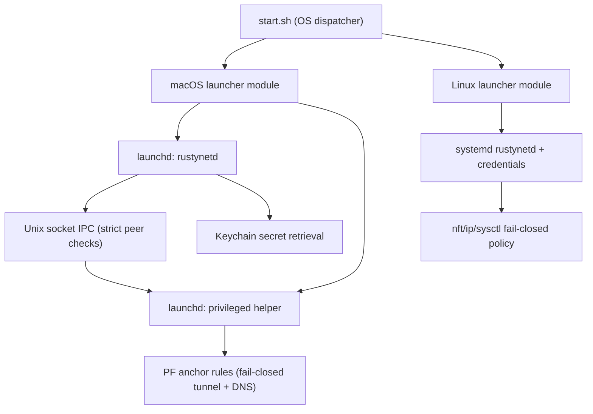

# Cross-Platform Security Gap Remediation Plan (Linux + macOS)

Date: 2026-03-05  
Scope: Rustynet install/runtime/dataplane parity hardening across Debian 13 and macOS, with Linux stability preserved as a hard constraint.

## AI Implementation Prompt

```text
You are the implementation agent for the remaining work in this document.
Repository root: /Users/iwanteague/Desktop/Rustynet

Mission:
Complete the remaining in-scope work in this file in one uninterrupted execution if feasible. Security is the top priority. Do not stop at planning if you can still write, test, and verify code safely.

Mandatory reading order:
1. /Users/iwanteague/Desktop/Rustynet/AGENTS.md
2. /Users/iwanteague/Desktop/Rustynet/CLAUDE.md
3. /Users/iwanteague/Desktop/Rustynet/README.md
4. /Users/iwanteague/Desktop/Rustynet/documents/Requirements.md
5. /Users/iwanteague/Desktop/Rustynet/documents/SecurityMinimumBar.md
6. This document
7. Directly linked scope/design docs and the code you will touch

Non-negotiables:
- one hardened execution path for each security-sensitive workflow
- fail closed on missing, stale, invalid, replayed, or unauthorized state
- no insecure compatibility paths, no legacy fallback branches, and no weakening of tests to make results pass
- no TODO/FIXME/placeholders for in-scope deliverables
- do not mark work complete until code, tests, and evidence exist

Execution workflow:
1. Read this document fully and convert every unchecked, open, pending, partial, or blocked item into a concrete checklist.
2. Execute the remaining work in the ordered sequence listed below.
3. Implement in small, verifiable increments, but continue until the remaining in-scope slice is complete or a real external blocker stops you.
4. After every material code change:
   - run targeted unit and integration tests for touched crates and modules
   - run smoke tests, dry runs, or CLI/service validators for the exact workflow you changed
   - rerun the most relevant gate before moving on
5. After every completed item:
   - update this document immediately instead of maintaining a separate private checklist
   - mark checkboxes and status blocks complete only after verification
   - append concise evidence: files changed, tests run, artifacts produced, residual risk, and blocker state if any
   - keep any existing session log, evidence table, acceptance checklist, or status summary current
6. Before claiming completion:
   - run repository-standard gates when the scope is substantial:
     cargo fmt --all -- --check
     cargo clippy --workspace --all-targets --all-features -- -D warnings
     cargo check --workspace --all-targets --all-features
     cargo test --workspace --all-targets --all-features
     cargo audit --deny warnings
     cargo deny check bans licenses sources advisories
   - run the scope-specific validations listed below
   - if live or lab validation is available, run it; if it is not available, do not fake success and record the blocker precisely
7. If a test or gate fails, fix the root cause. Never weaken the check, bypass the security control, or mark a synthetic path as good enough.

Document-specific execution order:
1. First verify and document that the Linux and Debian baseline remains unchanged after prior macOS hardening work.
2. Then close GAP-06 by replacing any remaining unsafe manual macOS operations with the same validated IPC-driven admin paths used on Linux.
3. Then close GAP-08 by keeping README, phase docs, runbooks, and support/security matrices synchronized with the code you changed.
4. Then reduce GAP-10 regression blast radius by further modularizing start.sh without reintroducing weaker shell paths.
5. Re-run parity and security evidence after every macOS-affecting change and fail closed on any Debian regression.

Scope-specific validation for this document:
- ./scripts/ci/phase6_gates.sh
- ./scripts/ci/phase10_gates.sh
- ./scripts/ci/membership_gates.sh
- ./scripts/ci/macos_dataplane_smoke.sh
- Debian two-node or equivalent Linux smoke validation if the lab is available.

Definition of done for this document:
The acceptance checklist in Section 8 is fully checked, Linux baseline evidence is refreshed, and no macOS parity fix depends on a weaker trust, DNS, lifecycle, or secret-handling path.

If full completion is impossible in one execution, continue until you hit a real external blocker, then mark the exact remaining items as blocked with the reason, the missing prerequisite, and the next concrete step.
```

## Current Open Work

This block is the quick source of truth for what remains in this document.
If historical notes later in the file conflict with this block, the AI prompt, or current code reality, update the stale section instead of following the stale note.

`Open scope`
- This document is mostly closed; the remaining work is narrow.
- Open items are Linux or Debian regression validation after macOS hardening, GAP-06 ops parity, GAP-08 documentation and support-matrix synchronization, and GAP-10 blast-radius reduction around start.sh.

`Do first`
- Re-validate the Linux and Debian baseline after any macOS-affecting change.
- Then close GAP-06 before spending time on lower-risk documentation or structure cleanup.

`Completion proof`
- The Section 8 acceptance checklist is fully checked, and Linux evidence is refreshed after the macOS work touched in the execution.
- Phase6, Phase10, membership, and macOS smoke validations stay green.

`Do not do`
- Do not reopen already remediated macOS gaps without evidence of regression.
- Do not weaken Linux trust, DNS, service, or custody behavior to improve parity wording.

`Clarity note`
- Treat this as a residual-gap cleanup document, not as a broad cross-platform feature roadmap.

Status update (verified against current tree on 2026-03-05):
- This is a remediation plan and includes historical gap statements. Several gaps are now remediated in implementation.
- Confirmed remediated or materially advanced: GAP-01 (explicit passphrase source wiring), GAP-02 (non-admin privileged-tool fallback removed), GAP-03 (macOS DNS fail-closed PF enforcement), GAP-04 (macOS reports `supports_ipv6=false`), GAP-05 (launchd lifecycle model), GAP-07 (macOS dataplane smoke/security CI gate; further depth still needed).
- Previously reported gate blocker for this stream (`phase10_gates.sh` / `membership_gates.sh` failing on missing Phase1 measured source) is now resolved by seeding `artifacts/perf/phase1/source/performance_samples.ndjson`.
- Phase 6 parity evidence generation is now integrated into `phase6_gates.sh` (report auto-generation from raw measured parity probes) with stricter source freshness validation in `check_phase6_platform_parity.sh`.
- `phase1_gates.sh` unsafe-keyword false positive is now remediated via code-token aware scanning (strings/comments excluded).
- Phase9/Phase10 measured evidence generation is now integrated into `phase9_gates.sh` and `phase10_gates.sh` with source freshness checks and fail-closed metadata validation.
- Membership gate fallback now uses repository-local bootstrap state only when runtime membership files are absent, while preserving strict runtime-path enforcement when `/var/lib/rustynet` state exists.
- Current gate status in this tree (2026-03-05): `phase10_gates.sh` and `membership_gates.sh` pass end-to-end.
- Debian two-node remote validation now passes end-to-end on Debian 13 with exit-node NAT active and exit state `ExitActive` (`artifacts/phase10/debian_two_node_remote_validation.md`, generated `2026-03-05T15:43:57Z`, commit `d02a159`).
- Security risk truth: the primary remaining risk in this document is drift between planned text and current implementation; stale guidance can cause insecure operator assumptions or mis-prioritized engineering work.
- Status update (verified against current tree on 2026-03-25): GAP-10 blast-radius reduction advanced by migrating `write_daemon_environment` to Rust. This removes significant complexity and environmental variable manipulation from `start.sh`, consolidating it into a testable Rust binary path.

## 1) Goals
- Keep Debian 13 behavior stable and secure while improving macOS parity.
- Remove contradictory or insecure fallback paths.
- Enforce fail-closed posture on both OS profiles for tunnel and DNS.
- Align docs, runtime behavior, and CI evidence with one coherent security model.

## 2) Non-Negotiable Constraints
- Linux regression is release-blocking.
- No weakening of existing Linux hardening (systemd credentials, strict permissions, fail-closed nftables model).
- No shell interpolation of untrusted values.
- Keep backend abstraction boundaries intact.
- Prefer built-in OS security primitives on macOS over custom mechanisms.

Relevant baseline docs:
- [Requirements.md](/Users/iwanteague/Desktop/Rustynet/documents/Requirements.md)
- [SecurityMinimumBar.md](/Users/iwanteague/Desktop/Rustynet/documents/SecurityMinimumBar.md)
- [phase10.md](/Users/iwanteague/Desktop/Rustynet/documents/phase10.md)

## 3) Current Split Quality (Assessment)

### 3.1 What is already clean
- Host profile detection and explicit storage segregation are present in `start.sh`:
  - [start.sh:96](/Users/iwanteague/Desktop/Rustynet/start.sh:96)
  - [start.sh:158](/Users/iwanteague/Desktop/Rustynet/start.sh:158)
- Backend mode is forced by host profile:
  - [start.sh:359](/Users/iwanteague/Desktop/Rustynet/start.sh:359)
- macOS runtime path exists (daemon + helper process path, PF anchor model):
  - [start.sh:1987](/Users/iwanteague/Desktop/Rustynet/start.sh:1987)
  - [start.sh:2011](/Users/iwanteague/Desktop/Rustynet/start.sh:2011)
  - [phase10.rs:1093](/Users/iwanteague/Desktop/Rustynet/crates/rustynetd/src/phase10.rs:1093)
- Privileged command execution uses argv-only commands with strict token validation:
  - [privileged_helper.rs:449](/Users/iwanteague/Desktop/Rustynet/crates/rustynetd/src/privileged_helper.rs:449)

### 3.2 Where split remains Linux-first
- Phase 10 scope and real E2E gates are explicitly Linux-only:
  - [phase10.md:14](/Users/iwanteague/Desktop/Rustynet/documents/phase10.md:14)
  - [phase10_gates.sh:121](/Users/iwanteague/Desktop/Rustynet/scripts/ci/phase10_gates.sh:121)
  - [real_wireguard_exitnode_e2e.sh:15](/Users/iwanteague/Desktop/Rustynet/scripts/e2e/real_wireguard_exitnode_e2e.sh:15)
- Linux service path is hardened systemd; macOS lifecycle is now launchd-managed:
  - [rustynetd.service:47](/Users/iwanteague/Desktop/Rustynet/scripts/systemd/rustynetd.service:47)
  - [start.sh:2126](/Users/iwanteague/Desktop/Rustynet/start.sh:2126)
  - [start.sh:2134](/Users/iwanteague/Desktop/Rustynet/start.sh:2134)
- Several admin dataplane actions are still Linux-only in menu layer:
  - [start.sh:2558](/Users/iwanteague/Desktop/Rustynet/start.sh:2558)
  - [start.sh:2590](/Users/iwanteague/Desktop/Rustynet/start.sh:2590)
  - [start.sh:2626](/Users/iwanteague/Desktop/Rustynet/start.sh:2626)

## 4) Gap Register

## GAP-01 (Critical, Remediated 2026-03-05; regression-critical): macOS passphrase-source runtime mismatch
- Where:
  - Runtime requires explicit passphrase source contract (`RUSTYNET_WG_KEY_PASSPHRASE_CREDENTIAL_PATH` or `CREDENTIALS_DIRECTORY`):
    - [key_material.rs:193](/Users/iwanteague/Desktop/Rustynet/crates/rustynetd/src/key_material.rs:193)
    - [key_material.rs:228](/Users/iwanteague/Desktop/Rustynet/crates/rustynetd/src/key_material.rs:228)
  - macOS launchd wiring now sets explicit env var:
    - [start.sh:2182](/Users/iwanteague/Desktop/Rustynet/start.sh:2182)
    - [start.sh:2183](/Users/iwanteague/Desktop/Rustynet/start.sh:2183)
- Security risk truth:
  - If this contract regresses, operators are likely to reintroduce unsafe fallback behavior under outage pressure.
- Residual action:
  - Keep preflight and CI checks pinned to explicit passphrase-source contract.

## GAP-02 (High, Remediated 2026-03-05; regression-critical): non-admin macOS fallback conflicts with root-owned privileged binary policy
- Current enforcement:
  - Non-admin path is blocked with fail-closed error:
    - [start.sh:1076](/Users/iwanteague/Desktop/Rustynet/start.sh:1076)
    - [start.sh:1079](/Users/iwanteague/Desktop/Rustynet/start.sh:1079)
  - Runtime/startup enforces root-owned privileged binaries:
    - [start.sh:1956](/Users/iwanteague/Desktop/Rustynet/start.sh:1956)
    - [start.sh:1957](/Users/iwanteague/Desktop/Rustynet/start.sh:1957)
  - User guidance aligned:
    - [README.md:32](/Users/iwanteague/Desktop/Rustynet/README.md:32)
- Security risk truth:
  - If this regresses, attacker-controlled user-space binaries can be executed in privileged networking paths.
- Residual action:
  - Keep explicit smoke checks for fallback removal and root-ownership enforcement in CI.

## GAP-03 (Critical, Remediated 2026-03-05; regression-critical): macOS DNS fail-closed implementation
- Current enforcement:
  - DNS protection toggles PF-backed rules in macOS dataplane system:
    - [phase10.rs:1422](/Users/iwanteague/Desktop/Rustynet/crates/rustynetd/src/phase10.rs:1422)
    - [phase10.rs:1431](/Users/iwanteague/Desktop/Rustynet/crates/rustynetd/src/phase10.rs:1431)
  - Kill-switch assertions verify DNS allow/block rules when DNS protection is active:
    - [phase10.rs:1468](/Users/iwanteague/Desktop/Rustynet/crates/rustynetd/src/phase10.rs:1468)
    - [phase10.rs:1489](/Users/iwanteague/Desktop/Rustynet/crates/rustynetd/src/phase10.rs:1489)
  - CI executes targeted macOS DNS fail-closed tests:
    - [macos_dataplane_smoke.sh:44](/Users/iwanteague/Desktop/Rustynet/scripts/ci/macos_dataplane_smoke.sh:44)
    - [macos_dataplane_smoke.sh:45](/Users/iwanteague/Desktop/Rustynet/scripts/ci/macos_dataplane_smoke.sh:45)
- Security risk truth:
  - If this regresses, DNS can leak off-tunnel and bypass policy/privacy guarantees.
- Residual action:
  - Keep DNS fail-closed tests mandatory in macOS CI for runtime/dataplane changes.

## GAP-04 (High, Short-Term Remediated 2026-03-05): macOS IPv6 capability signaling and behavior
- Current enforcement:
  - macOS backend now reports `supports_ipv6: false` to match current capabilities:
    - [lib.rs:775](/Users/iwanteague/Desktop/Rustynet/crates/rustynet-backend-wireguard/src/lib.rs:775)
    - [lib.rs:780](/Users/iwanteague/Desktop/Rustynet/crates/rustynet-backend-wireguard/src/lib.rs:780)
  - macOS PF path supports explicit IPv6 egress hard-disable toggles:
    - [phase10.rs:1437](/Users/iwanteague/Desktop/Rustynet/crates/rustynetd/src/phase10.rs:1437)
    - [phase10.rs:1443](/Users/iwanteague/Desktop/Rustynet/crates/rustynetd/src/phase10.rs:1443)
- Security risk truth:
  - True dual-stack parity is still pending; if future capability flags are loosened without matching enforcement, IPv6 leak paths can reappear.
- Residual action:
  - Keep `supports_ipv6=false` until full route/parity implementation and leak tests are complete.

## GAP-05 (High, Largely Remediated 2026-03-05; regression-critical): service-management hardening parity is weaker on macOS than Linux
- Where:
  - Linux hardened systemd profile:
    - [rustynetd.service:11](/Users/iwanteague/Desktop/Rustynet/scripts/systemd/rustynetd.service:11)
  - macOS helper/daemon launchd lifecycle wiring:
    - [start.sh:2126](/Users/iwanteague/Desktop/Rustynet/start.sh:2126)
    - [start.sh:2134](/Users/iwanteague/Desktop/Rustynet/start.sh:2134)
    - [MacosLaunchdServiceManagement.md:1](/Users/iwanteague/Desktop/Rustynet/documents/operations/MacosLaunchdServiceManagement.md:1)
- Security risk truth:
  - If launchd wiring or plist hardening drifts, privileged process lifecycle can become non-deterministic and weaken fail-closed posture.
- Residual action:
  - Keep launchd smoke checks and ownership/mode checks as release gates.

## GAP-06 (Medium): break-glass/manual peer admin flows are Linux-only
- Where:
  - Linux-only guards on manual peer operations:
    - [start.sh:2558](/Users/iwanteague/Desktop/Rustynet/start.sh:2558)
    - [start.sh:2590](/Users/iwanteague/Desktop/Rustynet/start.sh:2590)
    - [start.sh:2626](/Users/iwanteague/Desktop/Rustynet/start.sh:2626)
- Why this is a gap:
  - Operational inconsistency and increased chance of unsafe ad-hoc commands on macOS.
- Fix:
  1. Implement macOS equivalents using daemon IPC + helper path (not direct shell peer mutations).
  2. Keep break-glass confirmations and audit logging identical across OS.
- What fixed looks like:
  - Menu capability parity for supported admin operations across Linux/macOS.

## GAP-07 (High, Partially Remediated 2026-03-05): macOS dataplane security evidence in CI
- Current enforcement:
  - macOS CI now includes dataplane smoke gates:
    - [cross-platform-ci.yml:21](/Users/iwanteague/Desktop/Rustynet/.github/workflows/cross-platform-ci.yml:21)
    - [cross-platform-ci.yml:24](/Users/iwanteague/Desktop/Rustynet/.github/workflows/cross-platform-ci.yml:24)
  - Smoke script validates launch/path contracts and runs targeted dataplane tests:
    - [macos_dataplane_smoke.sh:7](/Users/iwanteague/Desktop/Rustynet/scripts/ci/macos_dataplane_smoke.sh:7)
    - [macos_dataplane_smoke.sh:44](/Users/iwanteague/Desktop/Rustynet/scripts/ci/macos_dataplane_smoke.sh:44)
- Security risk truth:
  - Residual risk remains because Linux-only real WireGuard netns E2E has no macOS equivalent yet; deep runtime regressions could still escape smoke coverage.
- Residual action:
  - Expand from smoke coverage to richer macOS integration/leak tests as infrastructure allows.

## GAP-08 (Medium): phase-scope/docs and runtime reality are mismatched
- Where:
  - Phase 10 says non-Linux dataplane out of scope:
    - [phase10.md:23](/Users/iwanteague/Desktop/Rustynet/documents/phase10.md:23)
  - README describes macOS runtime dataplane support:
    - [README.md:30](/Users/iwanteague/Desktop/Rustynet/README.md:30)
- Why this is a gap:
  - Confuses operational guarantees and security expectations.
- Fix:
  1. Publish explicit “current support matrix” by OS and feature (exit node, LAN toggle, DNS fail-close, CI evidence level).
  2. Update phase docs to include the parity-hardening phase after Phase 10.
- What fixed looks like:
  - No contradiction between phase docs, runtime behavior, and user guidance.

## GAP-09 (High, Mostly Remediated 2026-03-05; regression-critical): macOS key custody and passphrase source
- Current enforcement:
  - Keychain-backed custody path is wired in setup/runtime:
    - [start.sh:1533](/Users/iwanteague/Desktop/Rustynet/start.sh:1533)
    - [start.sh:1612](/Users/iwanteague/Desktop/Rustynet/start.sh:1612)
    - [start.sh:2178](/Users/iwanteague/Desktop/Rustynet/start.sh:2178)
  - Persistent plaintext passphrase files are explicitly rejected in macOS checks:
    - [start.sh:1378](/Users/iwanteague/Desktop/Rustynet/start.sh:1378)
    - [start.sh:1907](/Users/iwanteague/Desktop/Rustynet/start.sh:1907)
  - File fallback is disabled by default and only available via explicit emergency override:
    - [key_material.rs:337](/Users/iwanteague/Desktop/Rustynet/crates/rustynetd/src/key_material.rs:337)
    - [key_material.rs:339](/Users/iwanteague/Desktop/Rustynet/crates/rustynetd/src/key_material.rs:339)
- Security risk truth:
  - Remaining risk is operational misuse of emergency fallback override; if enabled without strict control, sensitive material handling posture weakens.
- Residual action:
  - Keep fallback override disabled by default, require explicit risk acceptance, and audit any temporary enablement.

## GAP-10 (Medium): monolithic `start.sh` increases cross-OS regression risk
- Where:
  - Single large mixed script with many host branches:
    - [start.sh:1](/Users/iwanteague/Desktop/Rustynet/start.sh)
- Why this is a gap:
  - High chance of accidental Linux regression while editing macOS paths.
- Fix:
  1. Split into common + OS-specific modules:
     - `scripts/start/common.sh`
     - `scripts/start/linux.sh`
     - `scripts/start/macos.sh`
  2. Keep shared policy validation in common layer.
- What fixed looks like:
  - OS-specific changes are isolated and testable with smaller diff blast radius.

## 5) Debian-Safe Rollout Strategy (Do-Not-Break Plan)

## Stage 0: Baseline lock
- Freeze current Debian behavior with:
  - `./scripts/ci/phase10_gates.sh`
  - two-node Debian clean install/tunnel validation script
- Capture artifacts before any macOS-focused change.

## Stage 1: Containment guards
- For each macOS patch:
  - No edits to Linux service units unless required.
  - No edits to Linux nft/ip/sysctl command paths.
  - Linux unit + Debian remote validation required pre-merge.
- Enforce with CI and review checklist.

## Stage 2: Critical macOS correctness fixes
- Maintain GAP-01/02/03 regression coverage and harden test depth.
- These remain highest-impact controls against credential fallback, privileged binary integrity drift, and DNS leakage regressions.

## Stage 3: IPv6/capability truth and service hardening
- Maintain GAP-04/05 regressions as release-blocking and progress to full IPv6 parity.

## Stage 4: Ops parity and CI evidence
- Implement GAP-06 and deepen GAP-07 from smoke checks to broader integration/leak coverage.

## Stage 5: Documentation and structure hardening
- Implement GAP-08 and GAP-10.

## 6) macOS Built-in Security Features to Use
- Keychain (`Security.framework`) for secret custody instead of disk passphrase files.
- `launchd` for service lifecycle hardening (daemon/helper supervision).
- PF anchors (`pfctl -a`) for scoped fail-closed firewall ownership and cleanup.
- Absolute-path, root-owned binary validation for privileged command execution.
- Unix-domain socket peer credential checks for helper authorization.

## 7) Validation Matrix (What “Secure and Working” Means)

Linux (Debian 13) must remain green:
- Existing Phase10/Linux CI gates pass.
- Two-node Debian tunnel validation report passes.
- No change in Linux service install defaults or fail-closed behavior.

macOS must newly prove:
- Fresh install succeeds with no manual secret hacks.
- Daemon/helper managed by launchd and restart correctly.
- Tunnel-up: traffic routes through `utun` path.
- Tunnel-down: fail-closed egress blocks.
- DNS fail-closed blocks off-tunnel DNS.
- No plaintext passphrase file persists on disk.
- Key custody permissions and ownership checks pass.

## 8) “Fixed Looks Like” Acceptance Checklist
- [x] macOS daemon boot path sets explicit passphrase source env and passes preflight.
- [x] Non-admin privileged binary fallback removed or replaced with equivalently hardened model.
- [x] macOS DNS fail-closed enforcement implemented and tested.
- [x] macOS IPv6 capability declaration matches actual enforcement.
- [x] macOS services run under launchd with deterministic lifecycle.
- [x] macOS CI includes dataplane security checks (not only compile/test).
- [x] macOS key custody defaults to Keychain-backed passphrase source; persistent plaintext passphrase files are rejected.
- [ ] Linux/Debian baseline unchanged and validated after each macOS change.
- [x] Support matrix docs are consistent across README/phase docs/runbooks.

## 9) Immediate Next Implementation Slice (Recommended)
1. GAP-06: close Linux-only manual peer admin parity gaps through IPC-driven macOS equivalents.
2. GAP-08: keep the support/security-evidence matrix synchronized across README/phase docs/runbooks as code evolves.
3. GAP-10: reduce cross-OS regression blast radius by modularizing `start.sh`.

This sequence provides highest risk reduction with lowest Debian regression risk.

## 10) Threat Model Snapshots by Gap

### GAP-01 Threat: startup secret-source confusion
- Attacker/Failure mode:
  - Operator error or inconsistent env leads to failed daemon startup.
  - Team adds insecure compatibility fallback to "fix startup quickly".
- Security impact:
  - Availability loss or accidental reintroduction of plaintext secret handling.
- Required control:
  - One explicit passphrase source contract on macOS launch path, enforced at startup.

### GAP-02 Threat: user-owned tool binary injection
- Attacker/Failure mode:
  - User-space writable `wg` or `wireguard-go` binary can be swapped/tampered.
- Security impact:
  - Privileged network operations can execute attacker-controlled code.
- Required control:
  - Root-owned, immutable-path privileged tools only; no non-admin fallback.

### GAP-03 Threat: DNS exfiltration when tunnel assumptions fail
- Attacker/Failure mode:
  - DNS traffic escapes protected tunnel path while tunnel is down/degraded.
- Security impact:
  - Domain leakage, policy bypass, potential active redirection.
- Required control:
  - PF-enforced DNS fail-closed rules with positive assertions and negative tests.

### GAP-04 Threat: IPv6 bypass on partial dual-stack enforcement
- Attacker/Failure mode:
  - IPv4 route forced through tunnel while IPv6 path remains open.
- Security impact:
  - Silent traffic leakage and policy non-compliance.
- Required control:
  - Capability truthfulness and enforced IPv6 block/route parity.

### GAP-05 Threat: weak privileged process lifecycle on macOS
- Attacker/Failure mode:
  - launchd unit/plist or environment drift causes degraded privileged lifecycle guarantees.
- Security impact:
  - Firewall/tunnel state desynchronization and weaker trust in runtime posture.
- Required control:
  - launchd-managed daemon/helper lifecycle with deterministic startup/restart.

### GAP-06 Threat: unsafe manual operations due to ops parity gaps
- Attacker/Failure mode:
  - Operators use direct ad-hoc shell commands on macOS for missing menu actions.
- Security impact:
  - Inconsistent validation/audit controls and accidental unsafe peer mutation.
- Required control:
  - Same validated IPC-driven admin paths on both OS families.

### GAP-07 Threat: undetected macOS dataplane regressions
- Attacker/Failure mode:
  - Security behavior breaks in deeper macOS runtime paths not covered by current smoke-level checks.
- Security impact:
  - Vulnerable releases reach users.
- Required control:
  - Mandatory macOS dataplane security gates in CI.

### GAP-08 Threat: documentation drift causes unsafe assumptions
- Attacker/Failure mode:
  - Users rely on docs that overstate support guarantees.
- Security impact:
  - Misconfigured deployments with weaker security than expected.
- Required control:
  - One support matrix and synchronized docs.

### GAP-09 Threat: persistent passphrase-at-rest exposure on macOS
- Attacker/Failure mode:
  - Local file disclosure, backup leak, or post-exploitation file scraping.
- Security impact:
  - Compromise of encrypted key material unlocking path.
- Required control:
  - Keychain-backed secret custody, disk plaintext elimination.

### GAP-10 Threat: monolithic installer regression blast radius
- Attacker/Failure mode:
  - Cross-OS edits accidentally affect Debian hardening path.
- Security impact:
  - Security regression introduced outside intended scope.
- Required control:
  - OS-modular script layout and path-specific tests.

## 11) Detailed Remediation Backlog (File-Level, Test-Level)

Status note:
- This backlog section is retained as an implementation history and forward plan.
- Items 11.1/11.2/11.3/11.4/11.5/11.7 are substantially completed in current tree and should be treated as regression-hardening references unless reopened by new findings.

### 11.1 GAP-01 implementation plan (Completed 2026-03-05)
- Files to change:
  - [start.sh](/Users/iwanteague/Desktop/Rustynet/start.sh)
  - [key_material.rs](/Users/iwanteague/Desktop/Rustynet/crates/rustynetd/src/key_material.rs) (only if startup diagnostics need improved errors)
- Changes:
  1. In macOS daemon launch/export section, set `RUSTYNET_WG_KEY_PASSPHRASE_CREDENTIAL_PATH` explicitly from resolved secure path.
  2. Add preflight validation in macOS branch to fail before daemon start if missing/unreadable.
  3. Keep symlink rejection and strict ownership/mode checks intact.
- Verification:
  - Positive:
    - fresh mac install path starts daemon without passphrase-source error.
  - Negative:
    - unset env and missing file must fail with explicit actionable message.
  - Debian guard:
    - rerun Debian CI gate and remote two-node script unchanged.

### 11.2 GAP-02 implementation plan (Completed 2026-03-05)
- Files to change:
  - [start.sh](/Users/iwanteague/Desktop/Rustynet/start.sh)
  - [README.md](/Users/iwanteague/Desktop/Rustynet/README.md)
- Changes:
  1. Remove non-admin local install fallback for `wg`/`wireguard-go`.
  2. Enforce root-owned, non-writable-by-group-or-other checks at startup.
  3. Improve setup error text: admin privileges required for privileged networking toolchain.
- Verification:
  - Positive:
    - admin install succeeds, runtime passes binary integrity checks.
  - Negative:
    - user-owned binary path is rejected.
  - Debian guard:
    - Linux tool path resolution and checks unchanged.

### 11.3 GAP-03 implementation plan (Completed 2026-03-05)
- Files to change:
  - [phase10.rs](/Users/iwanteague/Desktop/Rustynet/crates/rustynetd/src/phase10.rs)
  - macOS-specific test module in rustynetd crate
- Changes:
  1. Implement PF DNS block rules in protected mode.
  2. Explicitly allow DNS only over designated tunnel path/interface policy.
  3. Add assertions to verify PF anchor contains required DNS rules after apply.
  4. Ensure cleanup removes only Rustynet-owned anchor rules.
- Verification:
  - Positive:
    - tunnel up: DNS functional via protected path.
  - Negative:
    - tunnel down/off: DNS blocked.
    - off-tunnel resolver queries fail.
  - Debian guard:
    - Linux DNS fail-closed tests continue passing.

### 11.4 GAP-04 implementation plan (Completed short-term 2026-03-05)
- Files to change:
  - [lib.rs](/Users/iwanteague/Desktop/Rustynet/crates/rustynet-backend-wireguard/src/lib.rs)
  - [phase10.rs](/Users/iwanteague/Desktop/Rustynet/crates/rustynetd/src/phase10.rs) for policy alignment if needed
- Changes:
  1. Immediate safe mode: set macOS capability reporting to `supports_ipv6=false` until full parity is complete.
  2. Confirm PF policy blocks IPv6 egress in protected mode.
  3. Later phase: implement true IPv6 route management and restore capability flag.
- Verification:
  - Capability report reflects real behavior.
  - Leak test proves no IPv6 egress bypass when protected mode enabled.

### 11.5 GAP-05 implementation plan (Completed baseline 2026-03-05)
- Files to add/change:
  - `scripts/launchd/*.plist` (new)
  - [start.sh](/Users/iwanteague/Desktop/Rustynet/start.sh) (install/load/unload wrappers)
  - docs for service management
- Changes:
  1. Define LaunchDaemon for privileged helper.
  2. Define LaunchDaemon/LaunchAgent for daemon as architecture requires.
  3. Use fixed `ProgramArguments`, no shell interpolation.
  4. Configure restart policy, log paths, and strict ownership on plist/socket paths.
- Verification:
  - `launchctl bootstrap`/`kickstart` lifecycle works.
  - reboot persistence test passes.
  - helper authorization remains strict (peer credential checks).

### 11.6 GAP-06 implementation plan
- Files to change:
  - [start.sh](/Users/iwanteague/Desktop/Rustynet/start.sh)
  - daemon IPC handlers if missing for mac parity
- Changes:
  1. Port Linux-only peer admin menu actions to common IPC-driven actions.
  2. Keep same confirmation gates and audit entries.
  3. Keep privileged mutation logic in helper boundary only.
- Verification:
  - Same break-glass flows available on macOS and Linux.
  - audit logs contain equivalent entries for both.

### 11.7 GAP-07 implementation plan (Partially completed 2026-03-05)
- Files to change:
  - [cross-platform-ci.yml](/Users/iwanteague/Desktop/Rustynet/.github/workflows/cross-platform-ci.yml)
  - `scripts/ci/*mac*` (new)
- Changes:
  1. Add macOS dataplane smoke gate.
  2. Add macOS DNS/tunnel fail-closed leak tests.
  3. Make gate required for PRs touching macOS runtime/dataplane files.
- Verification:
  - Intentionally broken mac PF rule should fail CI.
  - Correct branch passes consistently.

### 11.8 GAP-08 implementation plan
- Files to change:
  - [README.md](/Users/iwanteague/Desktop/Rustynet/README.md)
  - [phase10.md](/Users/iwanteague/Desktop/Rustynet/documents/phase10.md)
  - new support matrix doc under `documents/operations/`
- Changes:
  1. Publish feature/support/security-evidence matrix by OS.
  2. Define confidence level per feature (implemented, hardened, CI-covered).
  3. Keep matrix updated as part of release checklist.
- Verification:
  - No contradictory statements across docs.
  - release review includes matrix diff.

### 11.9 GAP-09 implementation plan
- Files to change:
  - [key_material.rs](/Users/iwanteague/Desktop/Rustynet/crates/rustynetd/src/key_material.rs)
  - [start.sh](/Users/iwanteague/Desktop/Rustynet/start.sh)
  - [rustynet-crypto/lib.rs](/Users/iwanteague/Desktop/Rustynet/crates/rustynet-crypto/src/lib.rs)
- Changes:
  1. Move macOS passphrase retrieval to Keychain by default.
  2. Eliminate persistent plaintext passphrase file creation on macOS paths.
  3. Keep file fallback disabled by default; if emergency fallback exists, require explicit temporary override and warning.
  4. Zero sensitive buffers immediately after use where practical.
- Verification:
  - macOS setup completes with Keychain item, no disk passphrase artifact.
  - process/file inspection confirms no long-lived plaintext.
  - negative test: missing Keychain item fails closed with actionable remediation.

### 11.10 GAP-10 implementation plan
- Files to add/change:
  - `scripts/start/common.sh` (new)
  - `scripts/start/linux.sh` (new)
  - `scripts/start/macos.sh` (new)
  - [start.sh](/Users/iwanteague/Desktop/Rustynet/start.sh) (thin dispatcher)
- Changes:
  1. Extract OS-specific branches into separate modules.
  2. Keep shared validation and policy defaults in common module.
  3. Add shell linting/tests per module.
- Verification:
  - behavior parity tests pass before/after split.
  - reduced diff scope for OS-specific PRs.

## 12) Debian Regression Shield (Mandatory for Every macOS Security PR)

- Before merge:
  1. `cargo fmt --all -- --check`
  2. `cargo clippy --workspace --all-targets --all-features -- -D warnings`
  3. `cargo check --workspace --all-targets --all-features`
  4. `cargo test --workspace --all-targets --all-features`
  5. `cargo audit --deny warnings`
  6. `cargo deny check bans licenses sources advisories`
  7. `./scripts/ci/phase10_gates.sh`
  8. `./scripts/e2e/debian_two_node_clean_install_and_tunnel_test.sh`
- Merge condition:
  - Any Debian gate failure blocks merge even when change is macOS-only.
- Rollback rule:
  - If a post-merge Debian regression appears, revert the offending commit immediately and re-land with fixed gating evidence.

## 13) Target Secure Architecture (macOS parity without Linux regression)



Security properties this architecture must preserve:
- Secrets are sourced from OS-secure storage mechanisms by default.
- Privileged operations remain behind explicit validated boundary.
- Fail-closed network posture is enforced at OS firewall layer on both platforms.
- Linux and macOS startup/lifecycle are deterministic and auditable.

## 14) Completion Criteria for "Bulletproof v1" Cross-OS Claim

- Debian and macOS both satisfy:
  - fail-closed tunnel behavior,
  - fail-closed DNS behavior,
  - strict privileged binary/path integrity checks,
  - no persistent plaintext passphrase artifacts by default,
  - CI evidence that exercises real dataplane security behavior.
- Documentation and support matrix reflect exactly what is implemented and tested.
- No "less secure convenience fallback" remains enabled by default.
## Agent Update Rules

Use these rules every time you modify this document during implementation work.

1. Update the document immediately after each materially completed slice.
- Do not keep a private checklist that diverges from this file.
- This document must remain the public execution record.

2. Mark completion conservatively.
- Use `[x]` only after the code is implemented and verified.
- Use `Status: partial` when some hardening landed but real work remains.
- Use `Status: blocked` only for real external blockers; name the blocker precisely.

3. Record evidence under the section you touched, or in the existing session log/evidence table if the document already has one.
- Minimum evidence fields:
  - `Changed files:` exact paths
  - `Verification:` exact commands, tests, smoke runs, dry runs, gates
  - `Artifacts:` exact generated paths, if any
  - `Residual risk:` what still remains, if anything
  - `Blocker / prerequisite:` only when applicable

4. Use exact timestamps and commit references where possible.
- Prefer UTC timestamps in ISO-8601 format.
- If commits exist, record the commit SHA that contains the work.

5. Do not delete historical context that still matters.
- Correct stale claims when they are inaccurate.
- Do not erase previous findings, checklist items, or session history just to make the document look cleaner.

6. Keep security claims evidence-backed.
- Never write that a path is secure, complete, hardened, or production-ready without code and verification proof.
- If live validation is unavailable, state that explicitly and record the missing prerequisite.

7. If tests fail, record the failure honestly and fix the root cause.
- Do not weaken gates, remove checks, or relabel failures as acceptable.
- If a fix is incomplete, mark the item partial instead of complete.

